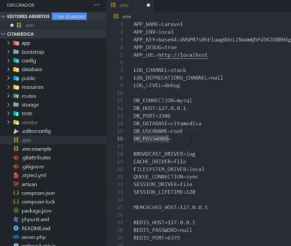
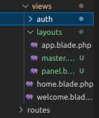
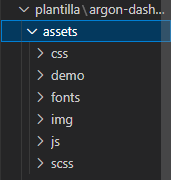
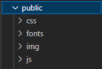
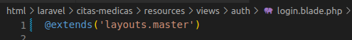
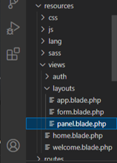
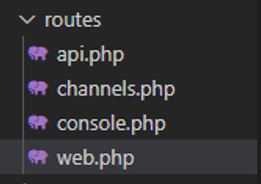
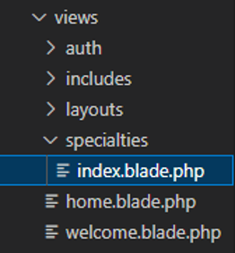
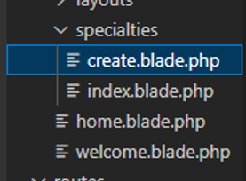
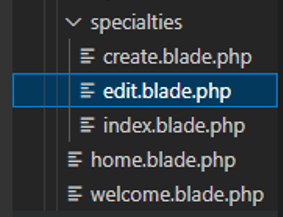

# Creamos el proyecto (1 video)

* composer create-project laravel/laravel citas-medicas

# subimos el proyecto a github
* git init
* git add -A
* git commit -m "inicio proyecto"
* git branch -M main
* git remote add origin https://github.com/Wladimirandrea/citas-medicas.git
* git push -u origin main

## Configuramos la base de datos (2 video)



## Instalamos sistema de autenticacion
* composer require laravel/ui
* php artisan ui vue --auth
* npm install && npm run dev
* npm run dev

## Hacemos la migracion de la base de datos
* php artisan migrate

## Creamos las vistas
    Resources > views > layouts > panel.blade.php
    Resources > views > layouts > master.blade.php



# Guardamos el proyecto a github
* git add -A
* git commit -m "2 video"
* git push -u origin main

## Copiamos los archivos de la plantilla (3 -video)
    Asset > ( css – fonts – img - js)


## Pegamos los archivos de la plantilla
    public > ( css – fonts – img - js)



## Remplazamos la dirección de los archivos
```
<link href="{{asset('img/brand/favicon.png')}}" rel="icon" type="image/png">
```

## Cambiamos el contenido de la vista Auth/Login
hacemos referencia a la vista padre (layouts.master)



## Cambiamos los atributos de los campos 

```
<input class="form-control" placeholder="Email" type="email" name="email" value="{{ old('email') }}" required autocomplete="email" autofocus>

<input id="password" type="password" class="form-control @error('password') is-invalid @enderror" name="password" required autocomplete="current-password">

<input class="custom-control-input" type="checkbox" name="remember" id="remember" {{ old('remember') ? 'checked' : '' }}>

```

## Modificamos el metodo Post

```
<form method="POST" action="{{ route('login') }}">
        @csrf
```

## Copiamos la ruta para recuperar la contraseña y registrar

```
<a href="{{ route('password.request') }}" class="text-light"><small>Forgot password?</small></a>
<a href="{{ route('register') }}" class="text-light"><small>Create new account</small></a>
```


## Creamos los mensajes de error
```
@if($errors->any())
    <div class="text-center text-muted mb-2">
        <h4>se encontro el siguiente error</h4>
    </div> 
    <div class="alert alert-danger mb-4" role="alert">
        {{$errors->first()}}
    </div>
@else
    <div class="text-center text-muted mb-4">
        <small>ingresa tus credenciales</small>
    </div> 
@endif
```

# Guardamos el proyecto a github
* git add -A
* git commit -m "3 video"
* git push -u origin main

## hacemos el registro (4 video)

## Copiamos y pegamos el archivo register de la plantilla example
```
view > auth > register.blade.php
```


## Modificamos los atibutos del registro
```
<input class="form-control" placeholder="Name" type="text" name="name" value="{{ old('name') }}" required autocomplete="name" autofocus>

<input class="form-control" placeholder="Email" type="email" name="email" value="{{ old('email') }}" required autocomplete="email">

<input class="form-control" placeholder="Password" type="password"  name="password" required autocomplete="new-password">
```
## Creamos un Nuevo campo para confirmar contraseña
```
<div class="form-group">
    <div class="input-group input-group-alternative">
    <div class="input-group-prepend">
        <span class="input-group-text"><i class="ni ni-lock-circle-open"></i></span>
    </div>
    <input class="form-control" placeholder="Password" type="password"  name="password_confirmation" required autocomplete="new-password">
    </div>
</div>
```
## Cambiamos el tipo del botón
```
<button type="submit" class="btn btn-primary mt-4">Create account</button>
```

## Cambiamos el tipo de formulario del registro
```
<form method="POST" action="{{ route('register') }}">
    @csrf
```

## Colocamos las notificaciones de error
```
@if($errors->any())
    <div class="text-center text-muted mb-2">
        <h4>se encotro el siguiente error</h4>
    </div> 
    <div class="alert alert-danger mb-4" role="alert">
        {{$errors->first()}}
    </div>
@else
    <div class="text-center text-muted mb-4">
        <small>ingresa tus credenciales</small>
    </div> 
@endif
```

## Creamos El panel administrativo (5video)
Copiamos la plantilla del dashboard a panel.blade.php



referenciamos la extension en home.blade.php
```
@extends('layouts.panel')
```

# Guardamos el proyecto a github
* git add -A
* git commit -m "3 video"
* git push -u origin main

## Creamos El menu lateral (6video)
creamos la carpeta includes/menu.blade.php
pegamos el menu lateral de la plantilla
hacemos referencia a los link del menu
<a class="nav-link " href="{{url('/especialidades')}}">
    <i class="ni ni-briefcase-24 text-blue"></i> Especialidades
</a>
hacemos el link de logout
<li class="nav-item">
    <a class="nav-link" href="{{route('logout')}}" onclick="event.preventDefault(); document.getElementById('formLogout').submit()">
        <i class="ni ni-button-power"></i> Cerrar sesion
    </a>
    <form action="{{route('logout')}}" method="POST" style="display: none;" id="formLogout">
            @csrf
    </form>
</li>

# Guardamos el proyecto a github
* git add -A
* git commit -m "6 video"
* git push -u origin main

## Creamos El footer (7video)
creamos la carpeta includes/footer.blade.php
pegamos el footer de la plantilla

# Guardamos el proyecto a github
* git add -A
* git commit -m "7 video"
* git push -u origin main

## Creamos El menu movil (8video)
creamos la carpeta includes/useroptions.blade.php
pegamos el menu movil de la plantilla

# Guardamos el proyecto a github
* git add -A
* git commit -m "8 video"
* git push -u origin main


## Creamos el modelo especialidad (video 9)
* php artisan make:model Specialty -mc

## Hacemos la migracion de speciality
```
 public function up()
    {
        Schema::create('specialties', function (Blueprint $table) {
            $table->increments('id');
            $table->string('name');
            $table->string('description')->nullable();
            $table->timestamps();
        });
    }
```
* php artisan migrate

## Creamos las rutas para especialidades


```
Route::get('/especialidades', [App\Http\Controllers\SpecialtyController::class, 'index']);
Route::get('/especialidades/create', [App\Http\Controllers\SpecialtyController::class, 'create']);
Route::get('/especialidades/{specialty}/edit', [App\Http\Controllers\SpecialtyController::class, 'edit']);
Route::post('/especialidades', [App\Http\Controllers\SpecialtyController::class, 'sendData']);
```

## creamos la funciones para el controlador
    public function __construct(){
        $this->middleware('auth');
    }
    public function index(){
        return view('specialties.index');
    }
## creamos la vista para especialidades



# Guardamos el proyecto a github
* git add -A
* git commit -m "9 video"
* git push -u origin main


## creamos el metodo crear para SpecialityController
 public function create(){
        return view('specialties.create');
    }

## creamos la vista create en la carpeta specialties


## Colocamos la ruta para el form de crear
```
<form method="POST" action="{{ url('/especialidades') }}">
    @csrf
```
## creamos el metodo para guardar los datos SpecialityController

    public function sendData(Request $request){
        $specialty = new Specialty();
        $specialty->name = $request->input('name');
        $specialty->description = $request->input('description');
        $specialty->save();
        return redirect('/especialidades');
    }

## importamos el modelo en el controlador

use App\Models\Specialty;

## creamos la lista de especialidades creadas

public function index(){
        $specialties = Specialty::all();
        return view('specialties.index', compact('$specialties'));
    }

## abrimos el archivo index de  la vista especialidades
    <tbody>
        @foreach ($specialties as $especialidad)
            <tr>
                <th scope="row">
                 {{$especialidad->name}}
                </th>
                <td>
                  {{$especialidad->description}}
                </td>
                
                <td>
                    <a href="" class="btn btn-sm btn-primary">Editar</a>
                    <a href="" class="btn btn-sm btn-danger">Eliminar</a>
                </td>
            </tr>
        @endforeach
    </tbody>

# Guardamos el proyecto a github
* git add -A
* git commit -m "10 video"
* git push -u origin main

## video 11

## hacemos reglas de validacion en el controlador en la funcion sendData

    public function sendData(Request $request){

        $rules = [
            'name' => 'required|min:3'
        ];
        $messages = [
            'name.required' => 'El nombre es obligatorio',
            'name.min' => 'el nombre debe ser 3 caracteres'
        ];
        $this->validate($request, $rules, $messages);

## colocamos el mensaje de error en el fomulario crear
    @if ($errors->any())
        @foreach ($errors->all() as $error)
            <div class="alert alert-danger" role="alert">
                <strong>Por favor</strong> {{$error}}
            </div>
        @endforeach        
    @endif

# Guardamos el proyecto a github
* git add -A
* git commit -m "11 video"
* git push -u origin main

## video 12
## creamos la funcion edit
   public function edit(Specialty $specialty){
        return view('specialties.edit', compact('specialty'));
    }

## creamos la vista edit


## copiamos la plantilla de create.blade.php

## colocamos los valores del input
    <input type="text" name="name" class="form-control" value="{{old('name', $specialty->name)}}">

    <input type="text" name="description" class="form-control" value="{{old('description', $specialty->description)}}">

## creamos una nueva ruta para editar los datos
    Route::put('/especialidades/{specialty}', [App\Http\Controllers\SpecialtyController::class, 'update']);

## creamos el metodo update

     public function update(Request $request, Specialty $specialty){

        $rules = [
            'name' => 'required|min:3'
        ];
        $messages = [
            'name.required' => 'El nombre es obligatorio',
            'name.min' => 'el nombre debe ser 3 caracteres'
        ];
        $this->validate($request, $rules, $messages);


        $specialty->name = $request->input('name');
        $specialty->description = $request->input('description');
        $specialty->save();
        return redirect('/especialidades');
    }

## modificar el formulario edit
        <form method="POST" action="{{ url('/especialidades/'.$specialty->id) }}">
                @csrf
                @method('PUT')

## creamos la ruta para eliminar
    Route::delete('/especialidades/{specialty}', [App\Http\Controllers\SpecialtyController::class, 'destroy']);

## hacemos la funcion destroy

    public function destroy(Specialty $specialty){
        $specialty->delete();
        return redirect('/especialidades');
    }

## modificamos el link de eliminar en el index

    <form action="{{url('/especialidades/'.$especialidad->id)}}" method="POST">
        @csrf
        @method('DELETE')
        <a href="{{url('/especialidades/'.$especialidad->id.'/edit')}}" class="btn btn-sm btn-primary">Editar</a>
        <button type="submit" class="btn btn-sm btn-danger">Eliminar</button>
    </form>

# Guardamos el proyecto a github
* git add -A
* git commit -m "12 video"
* git push -u origin main

## video 13
## creamos notificaciones para guardar y editar los registros
        $specialty->save();

        $notification = 'la especialidad se ha creado correctamente';
        return redirect('/especialidades')->with(compact('notification'));

## colocamos la notificacion en el index
        <div class="card-body">
          @if (session('notification'))
            <div class="alert alert-success" role="alert">
              {{session('notification')}}
            </div>
          @endif
        </div>

# Guardamos el proyecto a github
* git add -A
* git commit -m "13 video"
* git push -u origin main

# video 14
# creamos la pagina de los medicos

## modificamos la migracion de la tabla usuarios
    ```
    $table->string('cedula');
    $table->string('address')->nullable();
    $table->string('phone')->nullable();
    $table->string('role');
    ```
## creamos la ruta para los medicos

   Route::resource('medicos', 'App\Http\Controllers\DoctorController');
## creamos el controlador
    php artisan make:controller DoctorController --resource
## creamos las vistas para doctores
    views/doctors

# modificamos el methodo en DoctorController
    public function index()
    {
        $doctors = User::all();
        return view('doctors.index', compact('doctors'));
    }

# Guardamos el proyecto a github
* git add -A
* git commit -m "13 video"
* git push -u origin main


# video 15

## creamos la ruta para los pacientes

   Route::resource('medicos', 'App\Http\Controllers\PatientController');

## creamos el controlador
    php artisan make:controller PatientController --resource

## creamos las vistas para doctores
    views/patients

# modificamos el methodo en DoctorController
    
public function index()
    {
        $patients = User::all();
        return view('patients.index', compact('patients'));
    }


    public function create()
    {
        return view('patients.create');
    }

# Guardamos el proyecto a github
* git add -A
* git commit -m "15 video"
* git push -u origin main


# video 16
# creamos datos falso para los useroptions

    php artisan migrate:refresh --seed

# carpeta factories/ UserFactories

agregamos los nuevos campos a la tabla useroptions
    'cedula' => $this->faker->randomNumber(8, true),
    'address' => $this->faker->address(),
    'phone' => $this->faker->tollFreephoneNumber(),
    'role' => $this->faker->randomElement(['paciente', 'doctor']),

## creamos un nuevo seeder
    php artisan make:seeder UserstableSeeder

## modificamos el archivo seeder database/seeders/UserstableSeeder
## para crear un primer usuario admin

        User::create([
            'name' => 'Wladimir',
            'email' => 'wladimirandrea@gmail.com',
            'email_verified_at' => now(),
            'password' => bcrypt('123456789'), // password
            'cedula' => '17373687',
            'address' => 'calle 11',
            'phone' => '3024232053',
            'role' => 'admin',
        ]);
        User::factory()->count(50)->create();
## llamamos al seeders/databaseSeeder
    $this->call(UserstableSeeder::class);

## ejecutamos el comando para llamar al seeder
    php artisan db:seed


# Guardamos el proyecto a github
* git add -A
* git commit -m "16 video"
* git push -u origin main

# video 17

## filtramos los datos de los usuario por role
 app/http/models/User.php

    public function scopePatients($query){
        return $query->where('role','paciente');
    }
    public function scopeDoctors($query){
        return $query->where('role','doctor');
    }


## cambiamos la funcion en PatientController
    $patients = User::all();

    por

    $patients = User::patients()->get();


## cambiamos la funcion en DoctorController
    $doctors = User::all();

    por
     
    $doctors = User::doctors()->get();


# Guardamos el proyecto a github
* git add -A
* git commit -m "17 video"
* git push -u origin main

# video 18

## creamos editamos eliminamos registro de medicos

## modificamos la function store en doctorcontroller

public function store(Request $request)
    {
        $rules = [
            'name' => 'required|min:3',
            'email' => 'required|email',
            'cedula' => 'required|min:5',
            'address' => 'nullable|min:6',
            'phone' => 'required',
        ];
        $messages = [
            'name.required' => 'el nombre del medico es obligatorio',
            'name.min' => 'el nombre del medico debe tener mas de 3 caracteres',
            'email.required' => 'el correo electronico es obligatorio',
            'email.email' => 'ingresa un correo electronico valido',
            'cedula.required' => 'la cedula es obligatorio',
            'cedula.digits' => 'la cedula debe tener al menos 5 digitos',
            'name.required' => 'el nombre del medico es obligatorio',
            'address.min' => 'la direccion debe tener al menos de 5 caracteres',
            'phone.required' => 'el numero de telefono es obligatorio',
        ];
        $this->validate($request, $rules, $messages);
        User::create(
            $request->only('name','email','cedula','address','phone')
            + [
                'role' => 'doctor',
                'password' => bcrypt($request->input('password'))
            ]
        );
        $notification = 'El medico se ha registrado correctamente';
        return redirect('/medicos')->with(compact('notification'));
    }
## abrimos el modelo user models/user
protected $fillable = [
        'name',
        'email',
        'password',
        'cedula',
        'address',
        'phone',
        'role',
    ];

## agregamos el campo password en doctors/create
    <div class="form-group">
        <label for="password">Telefono</label>
        <input type="text" name="password" class="form-control" value="{{old('password', Srt::random(8))}}" required>
    </div>

## copiamos la ruta para genera el password
<?php
    use Illuminate\Support\Str;
?>

@extends('layouts.panel')

## creamos la vista para editar los medicos
 view/doctors/edit.blade.php
 copiamos la misma vista de create.blade

## editamos el metodo
    <form method="POST" action="{{ url('/medicos/'.$doctor->id) }}">
                @csrf
                @method('PUT')
## editamos los input de los campos
    <input type="text" name="name" class="form-control" value="{{old('name', $doctor->name)}}" >

## creamos la funcion para editar
public function edit($id)
    {
        $doctor = User::doctors()->findorfail($id);
        return view('doctors.edit', compact('doctor'));
    }

    public function update(Request $request, $id)
    {
        $rules = [
            'name' => 'required|min:3',
            'email' => 'required|email',
            'cedula' => 'required|min:5',
            'address' => 'nullable|min:6',
            'phone' => 'required',
        ];
        $messages = [
            'name.required' => 'el nombre del medico es obligatorio',
            'name.min' => 'el nombre del medico debe tener mas de 3 caracteres',
            'email.required' => 'el correo electronico es obligatorio',
            'email.email' => 'ingresa un correo electronico valido',
            'cedula.required' => 'la cedula es obligatorio',
            'cedula.digits' => 'la cedula debe tener al menos 5 digitos',
            'name.required' => 'el nombre del medico es obligatorio',
            'address.min' => 'la direccion debe tener al menos de 5 caracteres',
            'phone.required' => 'el numero de telefono es obligatorio',
        ];
        $this->validate($request, $rules, $messages);
        $user = User::doctors()->findorfail($id);
        $data = $request->only('name','email','cedula','address','phone');
        $password = $request->input('password');
        if($password)
            $data['password'] = bcrypt($password);
        $user->fill($data);
        $user->save();
        $notification = 'El medico se ha actualizado correctamente';
        return redirect('/medicos')->with(compact('notification'));
    }
## creamos el metodo para borrar
public function destroy($id)
    {
        $user = User::doctors()->findOrFail($id);
        $doctorName = $user->name;
        $user->delete();
        $notification = "El medico $doctorName Se elimino correctamente";
        return redirect('/medicos')->with(compact('notification'));
    }


# Guardamos el proyecto a github
* git add -A
* git commit -m "18 video"
* git push -u origin main


# video 19

## creamos editamos eliminamos registro de pacientes


## modificamos la function store en Patientcontroller

    public function store(Request $request)
    {
        $rules = [
            'name' => 'required|min:3',
            'email' => 'required|email',
            'cedula' => 'required|min:5',
            'address' => 'nullable|min:6',
            'phone' => 'required',
        ];
        $messages = [
            'name.required' => 'el nombre del paciente es obligatorio',
            'name.min' => 'el nombre del paciente debe tener mas de 3 caracteres',
            'email.required' => 'el correo electronico es obligatorio',
            'email.email' => 'ingresa un correo electronico valido',
            'cedula.required' => 'la cedula es obligatorio',
            'cedula.digits' => 'la cedula debe tener al menos 5 digitos',
            'name.required' => 'el nombre del paciente es obligatorio',
            'address.min' => 'la direccion debe tener al menos de 5 caracteres',
            'phone.required' => 'el numero de telefono es obligatorio',
        ];
        $this->validate($request, $rules, $messages);
        User::create(
            $request->only('name','email','cedula','address','phone')
            + [
                'role' => 'paciente',
                'password' => bcrypt($request->input('password'))
            ]
        );
        $notification = 'El paciente se ha registrado correctamente';
        return redirect('/pacientes')->with(compact('notification'));
    }


## agregamos el campo password en patients/create
    <div class="form-group">
        <label for="password">Telefono</label>
        <input type="text" name="password" class="form-control" value="{{old('password', Srt::random(8))}}" required>
    </div>

## copiamos la ruta para genera el password
<?php
    use Illuminate\Support\Str;
?>

@extends('layouts.panel')

## creamos la vista para editar los pacientes
 view/patients/edit.blade.php
 copiamos la misma vista de create.blade

## editamos el metodo
    <form method="POST" action="{{ url('/pacientes/'.$patient->id) }}">
                @csrf
                @method('PUT')
## editamos los input de los campos
    <input type="text" name="name" class="form-control" value="{{old('name', $patient->name)}}" >

## creamos la funcion para editar
    public function edit($id)
    {
        $patient = User::patients()->findorfail($id);
        return view('patients.edit', compact('patient'));
    }

    public function update(Request $request, $id)
     {
        $rules = [
            'name' => 'required|min:3',
            'email' => 'required|email',
            'cedula' => 'required|min:5',
            'address' => 'nullable|min:6',
            'phone' => 'required',
        ];
        $messages = [
            'name.required' => 'el nombre del paciente es obligatorio',
            'name.min' => 'el nombre del paciente debe tener mas de 3 caracteres',
            'email.required' => 'el correo electronico es obligatorio',
            'email.email' => 'ingresa un correo electronico valido',
            'cedula.required' => 'la cedula es obligatorio',
            'cedula.digits' => 'la cedula debe tener al menos 5 digitos',
            'name.required' => 'el nombre del paciente es obligatorio',
            'address.min' => 'la direccion debe tener al menos de 5 caracteres',
            'phone.required' => 'el numero de telefono es obligatorio',
        ];
        $this->validate($request, $rules, $messages);
        $user = User::patients()->findorfail($id);
        $data = $request->only('name','email','cedula','address','phone');
        $password = $request->input('password');
        if($password)
            $data['password'] = bcrypt($password);
        $user->fill($data);
        $user->save();
        $notification = 'El paciente se ha actualizado correctamente';
        return redirect('/pacientes')->with(compact('notification'));
    }
## creamos el metodo para borrar
    public function destroy($id)
     {
        $user = User::patients()->findOrFail($id);
        $patientName = $user->name;
        $user->delete();
        $notification = "El paciente $patientName Se elimino correctamente";
        return redirect('/pacientes')->with(compact('notification'));
    }


# Guardamos el proyecto a github
* git add -A
* git commit -m "19 video"
* git push -u origin main


# video 20
## Paginamos los registros 
 App/http/Controllers/Patientcontroller

  public function index()
    {
        $patients = User::patients()->paginate(10);
        return view('patients.index', compact('patients'));
    }
App/http/Controllers/Doctorcontroller

 public function index()
    {
        $doctors = User::doctors()->paginate(10);
        return view('doctors.index', compact('doctors'));
    }
## abrimos la vista patients/index.blade
        <div class="card-body">
            {{$patients->links()}}
        </div>
    </div>
    @endsection
## abrimos la vista doctors/index.blade
    <div class="card-body">
            {{$doctors->links()}}
        </div>
    </div>
    @endsection

## pegamos este comando para paginar
    php artisan vendor:publish --tag=laravel-pagination

## abrimos el archivo app/providers/appservicesprovider
    pegamos
    use Illuminate\Pagination\Paginator;
    use Illuminate\Support\ServiceProvider;

    public function boot()
    {
        Paginator::defaultView('vendor.pagination.bootstrap-4');
    }


# Guardamos el proyecto a github
* git add -A
* git commit -m "19 video"
* git push -u origin main

# video 21
## creamos el menu por roles
    views/includes/menu.blade

<h6 class="navbar-heading text-muted">
    @if(auth()->user()->role == 'admin')
        Gestion
    @else
        Menú
    @endif
</h6>
<ul class="navbar-nav">
    @if(auth()->user()->role == 'admin')
        <li class="nav-item  active ">
            <a class="nav-link  active " href="{{url('/home')}}">
                <i class="ni ni-tv-2 text-danger"></i> Dashboard
            </a>
        </li>
        <li class="nav-item">
            <a class="nav-link " href="{{url('/especialidades')}}">
                <i class="ni ni-briefcase-24 text-blue"></i> Especialidades
            </a>
        </li>
        <li class="nav-item">
            <a class="nav-link " href="/medicos">
                <i class="ni ni-pin-3 text-orange"></i> Medicos
            </a>
        </li>
        <li class="nav-item">
            <a class="nav-link " href="/pacientes">
                <i class="ni ni-single-02 text-yellow"></i> Pacientes
            </a>
        </li>
    @elseif(auth()->user()->role == 'doctor')
        <li class="nav-item">
            <a class="nav-link " href="">
                <i class="ni ni-calendar-grid-58 text-yellow"></i> Gestionar horarios
            </a>
        </li>
        <li class="nav-item">
            <a class="nav-link " href="">
                <i class="ni ni-time-alarm text-blue"></i> Mis citas
            </a>
        </li>
        <li class="nav-item">
            <a class="nav-link " href="">
                <i class="fas fa-bed text-success"></i> Mis Pacientes
            </a>
        </li>
    @else
        <li class="nav-item">
            <a class="nav-link " href="">
                <i class="ni ni-calendar-grid-58 text-blue"></i> Reservar Cita
            </a>
        </li>
        <li class="nav-item">
            <a class="nav-link " href="">
                <i class="ni ni-folder-17 text-success"></i> Mis citas
            </a>
        </li>


    @endif

    <li class="nav-item">
      <a class="nav-link" href="{{route('logout')}}" onclick="event.preventDefault(); document.getElementById('formLogout').submit()">
        <i class="ni ni-button-power text-danger"></i> Cerrar sesion
      </a>
        <form action="{{route('logout')}}" method="POST" style="display: none;" id="formLogout">
            @csrf
        </form>
    </li>
</ul>

@if(auth()->user()->role == 'admin')
    <!-- Divider -->
    <hr class="my-3">
    <!-- Heading -->
    <h6 class="navbar-heading text-muted">Reportes</h6>
    <!-- Navigation -->
    <ul class="navbar-nav mb-md-3">
    <li class="nav-item">
        <a class="nav-link" href="https://demos.creative-tim.com/argon-dashboard/docs/getting-started/overview.html">
        <i class="ni ni-spaceship"></i> Citas
        </a>
    </li>
    <li class="nav-item">
        <a class="nav-link" href="https://demos.creative-tim.com/argon-dashboard/docs/foundation/colors.html">
        <i class="ni ni-palette"></i> Desempeño medico
        </a>
    </li>

    </ul>
@endif


# Guardamos el proyecto a github
* git add -A
* git commit -m "19 video"
* git push -u origin main


# video 22
## creamos el middleware
 abrimos el archivo app/http/controllers/SpecialtyController
    boramos la funcion construct

    public function __construct(){
        $this->middleware('auth');
    }
## ponemos el comando para crear el middleware
    php artisan make:middleware AdminMiddleware
## abrimos el archivo middleware app/http/middleware/AdminMiddleware

 public function handle(Request $request, Closure $next)
    {
        if(auth()->user()->role == 'admin')
            return $next($request);
        return redirect ('/');
    }

## referenciamos el middlewareen el kernel app/http/kernel.php
 protected $routeMiddleware = [
        'admin' => \App\Http\Middleware\AdminMiddleware::class,
    ];

## creamos un grupo de rutas


Route::middleware(['auth', 'admin'])->group(function (){
    // Rutas especialidades
    Route::get('/especialidades', [App\Http\Controllers\SpecialtyController::class, 'index']);
    Route::get('/especialidades/create', [App\Http\Controllers\SpecialtyController::class, 'create']);
    Route::get('/especialidades/{specialty}/edit', [App\Http\Controllers\SpecialtyController::class, 'edit']);
    Route::post('/especialidades', [App\Http\Controllers\SpecialtyController::class, 'sendData']);
    Route::put('/especialidades/{specialty}', [App\Http\Controllers\SpecialtyController::class, 'update']);
    Route::delete('/especialidades/{specialty}', [App\Http\Controllers\SpecialtyController::class, 'destroy']);
    // Rutas medicos
    Route::resource('medicos', 'App\Http\Controllers\DoctorController');
    //Rutas pacientes
    Route::resource('pacientes', 'App\Http\Controllers\PatientController');

});

## organizamos los controladores por carpeta
    app/http/controller/Admin
    app/http/controller/Doctor
    app/http/controller/Patient
## movemos los archivos DoctorController, PatientController, SpecialityController a la Carpeta Admin

## modificamos la ruta en web
[App\Http\Controllers\Admin\SpecialtyController::class,

## modificamos la ruta en el controlador SpecialtyController -DoctorController -PatientController
namespace App\Http\Controllers\Admin;

use Illuminate\Http\Request;

use App\Http\Controllers\Controller;


# Guardamos el proyecto a github
* git add -A
* git commit -m "22 video"
* git push -u origin main


## creamos la rutas para el horario de los medicos
    Route::middleware(['auth', 'doctor'])->group(function (){

    });

##  creamos el middleware para doctor
    php artisan make:middleware DoctorMiddleware

## modificamos el DoctorMiddleware

    public function handle(Request $request, Closure $next)
        {
            if(auth()->user()->role == 'doctor')
                return $next($request);
            return redirect('/');
        }

## referenciamos el middleware en el kernel app/http/kernel.php
    'doctor' => \App\Http\Middleware\DoctorMiddleware::class,

## creamos la ruta
    Route::middleware(['auth', 'doctor'])->group(function (){
        Route::get('/horario', [App\Http\Controllers\Doctor\HorarioController::class, 'edit']);
    });
## creamos el controlador HorarioController
    php artisan make:controller Doctor/HorarioController

## creamos el metodo 
    public function edit(){
        $days = [
            'Lunes', 'Martes', 'Miecoles', 'Jueves','Viernes', 'Sabado','Domingo'
        ];
        return view('horario', compact('days'));
    }
## creamos la vista para horario
    view/horario.blade.php

## creamos el link en el menu view/includes/panel/menu.blade.php
        <li class="nav-item">
            <a class="nav-link " href="/horario">
                <i class="ni ni-calendar-grid-58 text-yellow"></i> Gestionar horarios
            </a>
        </li>

## copiamos la vista de doctor/index.blade.php
    modificamos el archivo
            <tbody>
                @foreach ($days as $day)
                    <tr>
                        <th>{{$day}}</th>
                        <td>

                            <label class="custom-toggle">
                              <input type="checkbox" checked>
                              <span class="custom-toggle-slider rounded-circle"></span>
                            </label>

                        </td>
                        <td>
                            <div class="row">
                                <div class="col">
                                    <select class="form-control">
                                        @for($i=8; $i<=11; $i++)
                                            <option value="">{{$i}}:00 AM</option>
                                            <option value="">{{$i}}:30 AM</option>
                                        @endfor
                                    </select>
                                </div>
                                <div class="col">
                                    <select class="form-control">
                                        @for($i=8; $i<=11; $i++)
                                            <option value="">{{$i}}:00 AM</option>
                                            <option value="">{{$i}}:30 AM</option>
                                        @endfor
                                    </select>
                                </div>

                            </div>
                        </td>
                        <td>
                            <div class="row">
                                <div class="col">
                                    <select class="form-control">
                                        @for($i=1; $i<=6; $i++)
                                            <option value="">{{$i}}:00 PM</option>
                                            <option value="">{{$i}}:30 PM</option>
                                        @endfor
                                    </select>
                                </div>
                                <div class="col">
                                    <select class="form-control">
                                        @for($i=1; $i<=6; $i++)
                                            <option value="">{{$i}}:00 PM</option>
                                            <option value="">{{$i}}:30 PM</option>
                                        @endfor
                                    </select>
                                </div>

                            </div>
                        </td>
                    </tr>
                @endforeach
            </tbody>


# Guardamos el proyecto a github
* git add -A
* git commit -m "23 video"
* git push -u origin main

# video 24
## Guardamos la infomacion de los horarios
## creamos el modelo horario
    php artisan make:model Horario -m

## creamos la migracion
        Schema::create('horarios', function (Blueprint $table) {
            $table->id();
            $table->unsignedSmallInteger('day');
            $table->boolean('active');
            $table->time('morning_start');
            $table->time('morning_end');
            $table->time('afternoon_start');
            $table->time('afternoon_end');

            $table->unsignedBigInteger('user_id');
            $table->foreign('user_id')->references('id')->on('users');
            $table->timestamps();
        });
## colocamos el form en horario.blade
    <form action="{{url('horario')}}" method="POST">
    @csrf

    <input type="checkbox" name="active[]" checked>


## creamos la ruta para guardar
    Route::post('/horario', [App\Http\Controllers\Doctor\HorarioController::class, 'store']);


## modificamos la funcion
    
    public function edit(){
        $days = [
            'Lunes', 'Martes', 'Miecoles', 'Jueves','Viernes', 'Sabado','Domingo'
        ];
        return view('horario', compact('days'));
    }
   public function store(Request $request){
        $active = $request->input('active') ?: [];
        $morning_start = $request->input('morning_start');
        $morning_end = $request->input('morning_end');
        $afternoon_start = $request->input('afternoon_start');
        $afternoon_end = $request->input('afternoon_end');

        for ($i=0; $i<7; ++$i)
            Horario::updateOrCreate(
                ['day'=>$i, 'user_id' => auth()->id()],
                [
                'active' => in_array($i, $active),
                'morning_start' => $morning_start[$i],
                'morning_end' => $morning_end[$i],
                'afternoon_start' => $afternoon_start[$i],
                'afternoon_end' => $afternoon_end[$i],
                ]
            );
            return back();
    }
## modificamos el modelo

    protected $fillable = [
        'day',
        'active',
        'morning_start',
        'morning_end',
        'afternoon_start',
        'afternoon_end',
        'user_id'

    ];

## hacemos la migracion
    php artisan migrate


# Guardamos el proyecto a github
* git add -A
* git commit -m "23 video"
* git push -u origin main


# video 25
## mostrar la infomacion de los horarios

## modificamos HorarioController
    public function edit(){
        $days = [
            'Lunes', 'Martes', 'Miecoles', 'Jueves','Viernes', 'Sabado','Domingo'
        ];
        $horarios = Horario::where('user_id', auth()->id())->get();
        $horarios->map(function($horarios){
            $horarios->morning_start = (new Carbon($horarios->morning_start))->format('g:i A');
            $horarios->morning_end = (new Carbon($horarios->morning_end))->format('g:i A');
            $horarios->afternoon_start = (new Carbon($horarios->afternoon_start))->format('g:i A');
            $horarios->afternoon_end = (new Carbon($horarios->afternoon_end))->format('g:i A');

        });
        /* dd($horarios->toArray()); */
        return view('horario', compact('days', 'horarios'));
    }
    public function store(Request $request){
        $active = $request->input('active') ?: [];
        $morning_start = $request->input('morning_start');
        $morning_end = $request->input('morning_end');
        $afternoon_start = $request->input('afternoon_start');
        $afternoon_end = $request->input('afternoon_end');

        for ($i=0; $i<7; ++$i)
            Horario::updateOrCreate(
                ['day'=>$i, 'user_id' => auth()->id()],
                [
                'active' => in_array($i, $active),
                'morning_start' => $morning_start[$i],
                'morning_end' => $morning_end[$i],
                'afternoon_start' => $afternoon_start[$i],
                'afternoon_end' => $afternoon_end[$i],
                ]
            );
            return back();
    }

## modificamos el horario.blade
    @foreach ($horarios as $key => $horario)
                        <tr>
                            <th>{{$days[$key]}}</th>
                            <td>
                                <label class="custom-toggle">
                                <input type="checkbox" name="active[]" value="{{$key}}" @if($horario->active) checked @endif>
                                <span class="custom-toggle-slider rounded-circle"></span>
                                </label>

                            </td>
                            <td>
                                <div class="row">
                                    <div class="col">
                                        <select class="form-control" name="morning_start[]">
                                            @for($i=8; $i<=11; $i++)
                                                <option value="{{$i}}:00"
                                                    @if($i.':00 AM' == $horario->morning_start) selected @endif>
                                                    {{$i}}:00 AM
                                                </option>
                                                <option value="{{$i}}:30"
                                                    @if($i.':30 AM' == $horario->morning_start) selected @endif>
                                                    {{$i}}:30 AM
                                                </option>
                                            @endfor
                                        </select>
                                    </div>
                                    <div class="col">
                                        <select class="form-control" name="morning_end[]">
                                            @for($i=8; $i<=11; $i++)
                                                <option value="{{$i}}:00"
                                                    @if($i.':00 AM' == $horario->morning_end) selected @endif>
                                                    {{$i}}:00 AM
                                                </option>
                                                <option value="{{$i}}:30"
                                                @if($i.':30 AM' == $horario->morning_end) selected @endif>
                                                    {{$i}}:30 AM
                                                </option>
                                            @endfor
                                        </select>
                                    </div>

                                </div>
                            </td>
                            <td>
                                <div class="row">
                                    <div class="col">
                                        <select class="form-control" name="afternoon_start[]">
                                            @for($i=1; $i<=6; $i++)
                                                <option value="{{$i+12}}:00"
                                                    @if($i.':00 PM' == $horario->afternoon_start) selected @endif>
                                                    {{$i}}:00 PM
                                                </option>
                                                <option value="{{$i+12}}:30"
                                                    @if($i.':30 PM' == $horario->afternoon_start) selected @endif>
                                                    {{$i}}:30 PM
                                                </option>
                                            @endfor
                                        </select>
                                    </div>
                                    <div class="col">
                                        <select class="form-control" name="afternoon_end[]">
                                            @for($i=1; $i<=6; $i++)
                                                <option value="{{$i+12}}:00"
                                                    @if($i.':00 PM' == $horario->afternoon_end) selected @endif>
                                                    {{$i}}:00 PM
                                                </option>
                                                <option value="{{$i+12}}:30"
                                                    @if($i.':30 PM' == $horario->afternoon_end) selected @endif>
                                                    {{$i}}:30 PM
                                                </option>
                                            @endfor
                                        </select>
                                    </div>

                                </div>
                            </td>
                        </tr>
                    @endforeach

# Guardamos el proyecto a github
* git add -A
* git commit -m "25 video"
* git push -u origin main

# video 26
## Validar el Intervalo de las Horas del Horario de los Médicos
    modificamos las notificaiones en horario.blade.php

            @if (session('errors'))
                <div class="alert alert-danger" role="alert">
                Los cambios se han guardado, pero siguientes errores:
                <ul>
                    @foreach(session('errors')as $error)
                        <li>{{$error}}</li>
                    @endforeach
                </ul>

                </div>
            @endif
## creamos la variable $errors en el metodo store HorarioController

     private $days = [
        'Lunes', 'Martes', 'Miecoles', 'Jueves','Viernes', 'Sabado','Domingo'
    ];
    public function edit(){

        $horarios = Horario::where('user_id', auth()->id())->get();

        if(count($horarios) > 0){
            $horarios->map(function($horarios){
                $horarios->morning_start = (new Carbon($horarios->morning_start))->format('g:i A');
                $horarios->morning_end = (new Carbon($horarios->morning_end))->format('g:i A');
                $horarios->afternoon_start = (new Carbon($horarios->afternoon_start))->format('g:i A');
                $horarios->afternoon_end = (new Carbon($horarios->afternoon_end))->format('g:i A');

            });
        }else{
            $horarios = collect();
            for ($i=0; $i<7; ++$i)
            $horarios->push(new Horario());
        }


        $days = $this->days;
        return view('horario', compact('days', 'horarios'));
    }
    public function store(Request $request){

        $active = $request->input('active') ?: [];
        $morning_start = $request->input('morning_start');
        $morning_end = $request->input('morning_end');
        $afternoon_start = $request->input('afternoon_start');
        $afternoon_end = $request->input('afternoon_end');

        $errors =[];

        for ($i=0; $i<7; ++$i){

            if($morning_start[$i] > $morning_end[$i]){
                $errors [] = 'Inconsistencia en El intervalo de las horas del turno de la mañana del dia ' . $this->days[$i] .'.' ;
            }
            if($afternoon_start[$i] > $afternoon_end[$i]){
                $errors [] = 'Inconsistencia en El intervalo de las horas del turno de la tarde del dia '. $this->days[$i] .'.';
            }
            Horario::updateOrCreate(
                ['day'=>$i, 'user_id' => auth()->id()],
                [
                'active' => in_array($i, $active),
                'morning_start' => $morning_start[$i],
                'morning_end' => $morning_end[$i],
                'afternoon_start' => $afternoon_start[$i],
                'afternoon_end' => $afternoon_end[$i],
                ]
            );
        }
            if(count($errors) > 0)
                return back()->with(compact('errors'));
            $notification = 'Los cambios se han guardado correctamente';
            return back()->with(compact('notification'));
    }

## modificamos la vista horario.blade
     @foreach ($horarios as $key => $horario)
                        <tr>
                            <th>{{$days[$key]}}</th>
                            <td>
                                <label class="custom-toggle">
                                <input type="checkbox" name="active[]" value="{{$key}}" @if($horario->active) checked @endif>
                                <span class="custom-toggle-slider rounded-circle"></span>
                                </label>

                            </td>
                            <td>
                                <div class="row">
                                    <div class="col">
                                        <select class="form-control" name="morning_start[]">
                                            @for($i=8; $i<=11; $i++)
                                                <option value="{{($i<10 ? '0' : '').$i}}:00"
                                                    @if($i.':00 AM' == $horario->morning_start) selected @endif>
                                                    {{$i}}:00 AM
                                                </option>
                                                <option value="{{($i<10 ? '0' : '').$i}}:30"
                                                    @if($i.':30 AM' == $horario->morning_start) selected @endif>
                                                    {{$i}}:30 AM
                                                </option>
                                            @endfor
                                        </select>
                                    </div>
                                    <div class="col">
                                        <select class="form-control" name="morning_end[]">
                                            @for($i=8; $i<=11; $i++)
                                                <option value="{{($i<10 ? '0' : '').$i}}:00"
                                                    @if($i.':00 AM' == $horario->morning_end) selected @endif>
                                                    {{$i}}:00 AM
                                                </option>
                                                <option value="{{($i<10 ? '0' : '').$i}}:30"
                                                @if($i.':30 AM' == $horario->morning_end) selected @endif>
                                                    {{$i}}:30 AM
                                                </option>
                                            @endfor
                                        </select>
                                    </div>

                                </div>
                            </td>
                            <td>
                                <div class="row">
                                    <div class="col">
                                        <select class="form-control" name="afternoon_start[]">
                                            @for($i=1; $i<=6; $i++)
                                                <option value="{{$i+12}}:00"
                                                    @if($i.':00 PM' == $horario->afternoon_start) selected @endif>
                                                    {{$i}}:00 PM
                                                </option>
                                                <option value="{{$i+12}}:30"
                                                    @if($i.':30 PM' == $horario->afternoon_start) selected @endif>
                                                    {{$i}}:30 PM
                                                </option>
                                            @endfor
                                        </select>
                                    </div>
                                    <div class="col">
                                        <select class="form-control" name="afternoon_end[]">
                                            @for($i=1; $i<=6; $i++)
                                                <option value="{{$i+12}}:00"
                                                    @if($i.':00 PM' == $horario->afternoon_end) selected @endif>
                                                    {{$i}}:00 PM
                                                </option>
                                                <option value="{{$i+12}}:30"
                                                    @if($i.':30 PM' == $horario->afternoon_end) selected @endif>
                                                    {{$i}}:30 PM
                                                </option>
                                            @endfor
                                        </select>
                                    </div>

                                </div>
                            </td>
                        </tr>
                    @endforeach


# Guardamos el proyecto a github
* git add -A
* git commit -m "26 video"
* git push -u origin main


# video 27
## registrar cita medicas
## creamos las rutas
    Route::get('/resevarcitas', [App\Http\Controllers\AppointmentController::class, 'create']);
    Route::post('/miscitas', [App\Http\Controllers\AppointmentController::class, 'store']);
## creamos el controlador
    php artisan make:controller AppointmentController
## creamos la funcion en el controlador
     public function create(){
        $specialties = Specialty::all();
        return view('appointments.create', compact('specialties'));
    }
## copiamos la plantilla de pacients/create.blade
<?php
    use Illuminate\Support\Str;
?>
@extends('layouts.panel')

@section('content')

      <div class="card shadow">
        <div class="card-header border-0">
          <div class="row align-items-center">
            <div class="col">
              <h3 class="mb-0">Registrar cita</h3>
            </div>
            <div class="col text-right">
              <a href="{{url('/')}}" class="btn btn-sm btn-primary">regresar</a>
            </div>
          </div>
        </div>
        <div class="card-body">

            @if ($errors->any())
                @foreach ($errors->all() as $error)
                    <div class="alert alert-danger" role="alert">
                        <strong>Por favor</strong> {{$error}}
                    </div>
                @endforeach

            @endif
            <form method="POST" action="{{ url('/reservarcitas') }}">
                @csrf
                <label for="name">Especialidad</label>
                    <select name="" id="" class="form-control">
                        @foreach($specialties as $especialidad)
                            <option value="{{$especialidad->id}}">{{$especialidad->name}}</option>
                        @endforeach
                    </select>
                
                <div class="form-group">
                    <label for="email">Medico</label>
                    <select name="" id="" class="form-control"></select>

                </div>
                <div class="form-group">
                    <label for="cedula">Fecha</label>
                    <div class="form-group">
                        <div class="input-group">
                            <div class="input-group-prepend">
                               <span class="input-group-text"><i class="ni ni-calendar-grid-58"></i></span>
                            </div>
                            <input class="form-control datepicker" placeholder="Seleccionar Fecha" type="text" value="{{date('Y-m-d')}}" data-date-format="yyyy-mm-dd" data-date-start-date="{{date('Y-m-d')}}" data-date-end-date="+30d">
                        </div>
                    </div>
                </div>
                <div class="form-group">
                    <label for="address">Hora de Atencion</label>
                    <input type="text" name="address" class="form-control" value="{{old('address')}}" required>

                </div>
                <div class="form-group">
                    <label for="phone">Tipo de consulta</label>
                    <input type="text" name="phone" class="form-control" value="{{old('phone')}}" required>

                </div>

                <button type="submit" class="btn btn-sm btn-primary">crear cita</button>
            </form>
        </div>
      </div>
    </div>

</div>
@endsection
@section('scripts')
    <script src="{{asset('/js/plugins/bootstrap-datepicker/dist/js/bootstrap-datepicker.min.js')}}"></script>
@endsection


# Guardamos el proyecto a github
* git add -A
* git commit -m "27 video"
* git push -u origin main

# video 28
## relacion de las tablas
## creamos tabla intermedia
 php artisan make:migration create_specialty_user_table
## modificamos los campos de la tabla 
    Schema::create('specialty_user', function (Blueprint $table) {
            $table->bigIncrements('id');

            //Doctor
            $table->unsignedBigInteger('user_id');
            $table->foreign('user_id')->references('id')->on('users')->onDelete('cascade');
            //Specialty
            $table->unsignedBigInteger('specialty_id');
            $table->foreign('specialty_id')->references('id')->on('specialties')->onDelete('cascade');

            $table->timestamps();
        });
## cambiamos el tipo de id en la tabla specialties, users, horarios
    $table->bigIncrements('id');

## definimos la relacion en el modelo specialty
    public function users(){
        return $this->belongsToMany(User::class);
    }
## definimos la relacion en el modelo users
    public function specialties(){
        return $this->belongsToMany(Specialty::class);
    }
## creamos unos usuarios de prueba en el seeder para refrescar la migration
    User::create([
            'name' => 'Admin',
            'email' => 'Admin@gmail.com',
            'email_verified_at' => now(),
            'password' => bcrypt('123456789'), // password
            'cedula' => '17373687',
            'address' => 'calle 11',
            'phone' => '3024232053',
            'role' => 'admin',
        ]);
## creamos otro para paciente y doctor cambiando el role y el nombre
            'role' => 'paciente',

## hacemos la migracion
    php artisan migrate:refresh --seed

# Guardamos el proyecto a github
* git add -A
* git commit -m "28 video"
* git push -u origin main

# video 29
## seleccion multiple de especialidades

## abrimos view doctor/create 
    @section('styles')
        <link rel="stylesheet" href="https://cdn.jsdelivr.net/npm/bootstrap-select@1.13.14/dist/css/bootstrap-select.min.css">
    @endsection

    @section('scripts')
        <script src="https://cdn.jsdelivr.net/npm/bootstrap-select@1.13.14/dist/js/bootstrap-select.min.js"></script>

    @endsection
## refrenciamos los script y style en layouts/panel.blade
    @yield('styles')

## agregamos el campo especialidades en doctor/create.blade.php
    <div class="form-group">
        <label for="specialties">Especialidades</label>
        <select name="specialties[]" id="specialties" class="form-control selectpicker" data-style="btn-primary" title="Seleccionar especialidades" required>
        </select>
    </div>

## creamos variable $specialities admin/DoctorController
    public function create()
    {
        $specialties = Specialty::all();
        return view('doctors.create', compact('specialties'));
    }
## abrimos el archivo databaseSeeder
    public function run()
    {
        $this->call(UserstableSeeder::class);
        $this->call(SpecialtiesTableSeeder::class);
    }
## creamos el SpecialtiesTableSeeder
    php artisan make:seeder SpecialtiesTableSeeder

## creamos la funcion
    public function run()
    {
        $specialties = [
            'Neurologia',
            'Quirurgica',
            'Pediatria',
            'Cardiologia',
            'Urologia',
            'medicina Forense',
            'dermatologia',
        ];
        foreach ($specialties as $specialty){
            Specialty::create([
                'name' => $specialty
            ]);
        }
    }

## hacemos la migracion
    php artisan migrate:refresh --seed

## modificamos el campo especialidades en doctor/create.blade.php
        <div class="form-group">
                    <label for="specialties">Especialidades</label>
                    <select name="specialties[]" id="specialties" class="form-control selectpicker" data-style="btn-primary" title="Seleccionar especialidades" multiple required>
                        @foreach ($specialties as $especialidad)
                            <option value="{{$especialidad->id}}">{{$especialidad->name}}</option>
                        @endforeach
                    </select>
        </div>

# Guardamos el proyecto a github
* git add -A
* git commit -m "29 video"
* git push -u origin main


# video 30
## Guardar las especialidades en tabla intermedia

## doctorcontroller
        $user = User::create(
            $request->only('name','email','cedula','address','phone')
            + [
                'role' => 'doctor',
                'password' => bcrypt($request->input('password'))
            ]
        );
        $user->specialties()->attach($request->input('specialties'));

## editamos las especialidades del medico en el doctorcontroller
    public function edit($id)
        {
            $doctor = User::doctors()->findorfail($id);
            $specialties = Specialty::all();
            return view('doctors.edit', compact('doctor', 'specialties'));
        }

## copiamos el campo specialty de create.blade a edit.blade
    <div class="form-group">
                    <label for="specialties">Especialidades</label>
                    <select name="specialties[]" id="specialties" class="form-control selectpicker" data-style="btn-primary" title="Seleccionar especialidades" multiple required>
                        @foreach ($specialties as $especialidad)
                            <option value="{{$especialidad->id}}">{{$especialidad->name}}</option>
                        @endforeach
                    </select>
                </div>

## copiamos y pegamos @yield('styles') y @yield('script')
## hacemos el siguiente script

    <script>
        $(document).ready(()=>{});
        $('#specialties').selectpicker('val', @json($specialty_ids));
    </script>


## modificamo la funcion edit doctorcontroller
    public function edit($id)
    {
        $doctor = User::doctors()->findorfail($id);
        $specialties = Specialty::all();
        $specialty_ids = $doctor->specialties()->pluck('specialties.id');
        return view('doctors.edit', compact('doctor', 'specialties', 'specialty_ids'));
    }

## hacer que se guarden los cambios de edit
    en el metodo update en el doctorcontroller
    $user->specialties()->sync($request->input('specialties'));

## agregamos los campos create y update at para specialty_user
    modelo user y modelo specialty

    public function specialties(){
        return $this->belongsToMany(Specialty::class)->withTimestamps();
    }
    public function users(){
        return $this->belongsToMany(User::class)->withTimestamps();
    }

# Guardamos el proyecto a github
* git add -A
* git commit -m "30 video"
* git push -u origin main

# video 31
## filtramos los medicos por especialidades

## creamos una ruta Y los agrupamos

Route::middleware('auth')->group(function () {

    Route::get('/resevarcitas', [App\Http\Controllers\AppointmentController::class, 'create']);
    Route::post('/miscitas', [App\Http\Controllers\AppointmentController::class, 'store']);
    //JSON
    Route::get('/especialidades/{specialty}/medicos', [App\Http\Controllers\Api\SpecialtyController::class, 'doctors']);

});

## creamos el controlador
    php artisan make:controller Api/SpecialtyController

## creamos el metodo doctors
    public function doctors(Specialty $specialty){
        return $specialty->users()->get([
            'users.id',
            'users.name'
        ]);
    }
## abrimo el modelo user
    protected $hidden = [
        'password',
        'remember_token',
        'pivot'
    ];

## abrimos la vista appointments/create
    <div class="form-group">
                    <label for="specialty">Especialidad</label>
                    <select name="specialty_id" id="specialty" class="form-control">
                        <option value="">Seleccionar especialidad</option>
                        @foreach($specialties as $especialidad)
                            <option value="{{$especialidad->id}}">{{$especialidad->name}}</option>
                        @endforeach
                    </select>
                </div>
                <div class="form-group">
                    <label for="doctor">Medico</label>
                    <select name="doctor_id" id="doctor" class="form-control"></select>

                </div>
    <script>
        let $doctor;
        $(function(){
            const $specialty = $('#specialty');
            $doctor = $('#doctor');

            $specialty.change(() => {
                const specialtyId = $specialty.val();
                const url = `/especialidades/${specialtyId}/medicos`
                $.getJSON(url, onDoctorsLoaded)
            });
        });
        function onDoctorsLoaded (doctors){
            let htmlOptions = '';
            doctors.forEach(doctor => {
                htmlOptions += `<option value="${doctor.id}">${doctor.name}</option>`;
            });
            $doctor.html(htmlOptions);
        }
    </script>


# Guardamos el proyecto a github
* git add -A
* git commit -m "30 video"
* git push -u origin main

# video 32
## horarios de Atencion por intervalo
## creamos la ruta
        Route::get('/horario/horas', [App\Http\Controllers\Api\HorarioController::class, 'hours']);
## creamos el controlador
    php artisan make:controller Api/HorarioController

## hacemos la funcion en el controlador
use Carbon\Carbon;
use App\Models\Horario;

public function hours(Request $request){
        $rules = [
            'date' => 'required|date_format:"Y-m-d"',
            'doctor_id' => 'required|exists:users,id'
        ];
        $this->validate($request, $rules);

        $date = $request->input('date');
        $dateCarbon = new Carbon('date');
        $i = $dateCarbon->dayOfWeek;
        $day = ($i==0 ? 6 : $i-1);
        $doctorId = $request->input('doctor_id');
        $horario = Horario::where('active', true)->where('day', $day)->where('user_id', $doctorId)->first([
            'morning_start', 'morning_end',
            'afternoon_start', 'afternoon_end'
        ]);
        if(!$horario){
            return [];
        }
        $morningIntervalos = $this->getIntervalos(
            $horario->morning_start, $horario->morning_end
        );
        $afternoonIntervalos = $this->getIntervalos(
            $horario->afternoon_start, $horario->afternoon_end
        );
        $data = [];
        $data['morning'] = $morningIntervalos;
        $data['afternoon'] = $afternoonIntervalos;
        return $data;
    }
    private function getIntervalos($start, $end){
        $start = new Carbon($start);
        $end = new Carbon($end);

        $intervalos = [];
        while($start < $end){
            $intervalo = [];
            $intervalo['start'] = $start->format('g:i A');
            $start->addMinutes(30);
            $intervalo['end'] = $start->format('g:i A');
            $intervalos[]= $intervalo;
        }
        return $intervalos;
    }


# Guardamos el proyecto a github
* git add -A
* git commit -m "32 video"
* git push -u origin main

# video 33
## horarios de Atencion dinamica

    copiamos el script en una nueva carpeta public/js/create.js
    referenciamos en appointments/create.blade

    <script src="{{asset('/js/appointments/create.js')}}">
## agregamos el input fecha el id="date"
                <input class="form-control datepicker"
                            id="date"
                            placeholder="Seleccionar Fecha"
                            type="text" value="{{date('Y-m-d')}}"
                            data-date-format="yyyy-mm-dd"
                            data-date-start-date="{{date('Y-m-d')}}"
                            data-date-end-date="+30d">

                <div class="form-group">
                    <label for="address">Hora de Atencion</label>
                    <div class="container">
                        <div class="row">
                            <div class="col">
                                <h4 class="m-3" id="titleMorning"></h4>
                                <div id="hoursMorning"></div>
                            </div>
                            <div class="col">
                                <h4 class="m-3" id="titleAfternoon"></h4>
                                <div id="hoursAfternoon"></div>
                            </div>

                        </div>
                    </div>

                </div>

## modificar el script create.js

    let $doctor, $date, $specialty, iRadio;
    let $hoursMorning, $hoursAfternoon, $titleMorning, $titleAfternoon;

    const titleMorning = `En la Mañana`;
    const titleAfternoon = `En la tarde`;

    const noHours = `<h5 class="text-danger">
                    No hay horas disponibles
                    </h5>`;

    $(function(){
        $specialty = $('#specialty');
        $doctor = $('#doctor');
        $date = $('#date');
        $titleMorning = $('#titleMorning');
        $hoursMorning = $('#hoursMorning');
        $titleAfternoon = $('#titleAfternoon');
        $hoursAfternoon = $('#hoursAfternoon');

        $specialty.change(() => {
            const specialtyId = $specialty.val();
            const url = `/especialidades/${specialtyId}/medicos`
            $.getJSON(url, onDoctorsLoaded)
        });

        $doctor.change(loadHours);
        $date.change(loadHours);
    });

    function onDoctorsLoaded (doctors){
        let htmlOptions = '';
        doctors.forEach(doctor => {
            htmlOptions += `<option value="${doctor.id}">${doctor.name}</option>`;
        });
        $doctor.html(htmlOptions);
        loadHours();
    }

    function loadHours(){
        const selectedDate = $date.val();
        const doctorId = $doctor.val();
        const url = `/horario/horas?date=${selectedDate}&doctor_id=${doctorId}`;
        $.getJSON(url, displayHours);
    }

    function displayHours(data){
        let htmlHoursM = '';
        let htmlHoursA = '';

        iRadio = 0;

        if(data.morning){
            const morning_intervalos = data.morning;
            morning_intervalos.forEach(intervalo => {
                htmlHoursM += getRadioIntervaloHTML(intervalo);
            });
        }
        if(!htmlHoursM != ""){
            htmlHoursM += noHours;
        }


        if(data.afternoon){
            const afternoon_intervalos = data.afternoon;
            afternoon_intervalos.forEach(intervalo => {
                htmlHoursA += getRadioIntervaloHTML(intervalo);
            });
        }
        if(!htmlHoursA != ""){
            htmlHoursA += noHours;
        }

        $hoursMorning.html(htmlHoursM);
        $hoursAfternoon.html(htmlHoursA);
        $titleMorning.html(titleMorning);
        $titleAfternoon.html(titleAfternoon);

    }

    function getRadioIntervaloHTML(intervalo){
        const text = `${intervalo.start} - ${intervalo.end}`;
        return `<div class="custom-control custom-radio mb-3">
                    <input type="radio" id="interval${iRadio}" name="interval" class="custom-control-input" value="${text}">
                    <label class="custom-control-label" for="interval${iRadio++}">${text}</label>
                </div>`;
    }


# Guardamos el proyecto a github
* git add -A
* git commit -m "33 video"
* git push -u origin main


# video 34
## guardamos la informacion de los horario de la cita

## Agregamos los optios de tipo de consulta 

    <div class="custom-control custom-radio mt-3 mb-3">
        <input type="radio" id="type1" name="type" class="custom-control-input">
        <label class="custom-control-label" for="type1">Consulta</label>
    </div>
## agregamos un mark para las horas de Atencion
    <div id="hoursMorning">
        <mark>
            <small class="text-warning display-5">
                Selecciona un medico y una fecha, para ver las horas disponibles
            </small>
        </mark>
    </div>

## modificamos la function getRadioIntervaloHTML(intervalo)

function getRadioIntervaloHTML(intervalo){
    const text = `${intervalo.start} - ${intervalo.end}`;
    return `<div class="custom-control custom-radio mb-3">
                <input type="radio" id="interval${iRadio}" name="scheduled_time" value="${intervalo.start}" class="custom-control-input" value="${text}" required>
                <label class="custom-control-label" for="interval${iRadio++}">${text}</label>
            </div>`;
}

## creamos la ruta para guardar
    Route::post('/reservacitas', [App\Http\Controllers\AppointmentController::class, 'store']);
    Route::post('/miscitas', [App\Http\Controllers\AppointmentController::class, 'index']);

## creamos la funcion store en AppointmentController
    public function store(Request $request){
        
    }
## creamos el modelo appointment
    php artisan make:model Appointment -m

## modificamos la tabla 
    Schema::create('appointments', function (Blueprint $table) {
            $table->bigIncrements('id');

            $table->date('scheduled_date');
            $table->time('scheduled_time');
            $table->string('type');
            $table->string('description');

            //doctor
            $table->unsignedBigInteger('doctor_id');
            $table->foreign('doctor_id')->references('id')->on('users')->ondelete('cascade');

            //paciente
            $table->unsignedBigInteger('patient_id');
            $table->foreign('patient_id')->references('id')->on('users')->ondelete('cascade');

            //specialty
            $table->unsignedBigInteger('specialty_id');
            $table->foreign('specialty_id')->references('id')->on('specialties')->ondelete('cascade');


            $table->timestamps();
        });

## modificamos el modelo appointment
    protected $fillable = [
        'scheduled_date',
        'scheduled_time',
        'type',
        'description',
        'doctor_id',
        'patient_id',
        'specialty_id',
    ];

## creamos la funcion en el controlador
    public function store(Request $request){
        $rules = [
            'scheduled_time' => 'required',
            'type' => 'required',
            'description' => 'required',
            'doctor_id' => 'exists:users,id',
            'specialty_id' => 'exists:specialties,id',

        ];
        $messages = [
            'scheduled_time.required' => 'Debe seleccionar una hora valida para su cita',
            'type.required' => 'Debe seleccionar el tipo de consulta',
            'description.required' => 'Debe colocar sus sintomas'
        ];
        $this->validate($request, $rules, $messages);
        $data = $request->only([
            'scheduled_date',
            'scheduled_time',
            'type',
            'description',
            'doctor_id',
            'specialty_id',
        ]);
        $data['patient_id'] = auth()->id();
        $carbonTime = Carbon::createFromFormat('g:i A', $data['scheduled_time']);
        $data['scheduled_time'] = $carbonTime->format('H:i:s');
        Appointment::create($data);
        $notification = 'la cita se ha relizado correctamente';
        return back()->with(compact('notification'));
    }

## creamos nuevamente la migracion 
    php artisan migrate:refresh --seed

# Guardamos el proyecto a github
* git add -A
* git commit -m "34 video"
* git push -u origin main

# video 35
## recuperar los datos del formulario

## agregamos datos por defectos en los seeder
    database/seeders/UserstableSeeder

    User::factory()->count(50)->state(['role' => 'paciente'])->create();
## abrimos database/seeders/SpecialtiesTableSeeder
    foreach ($specialties as $specialtyName){
            $specialty = Specialty::create([
                'name' => $specialtyName
            ]);
            $specialty->users()->saveMany(
                User::factory(4)->state(['role' => 'doctor'])->make()
            );
        }
## hacemos la migracion
    php artisan migrate:refresh --seed

## Creamos un nuevo seeder
    php artisan make:seeder HorariosTableSeeder

## definimos los horario por defecto
    public function run()
    {
        for($i=0; $i<7; ++$i){
            Horarios::create([
                'day' => $i,
                'active' => ($i==0),
                'morning_start' => ($i==0 ? '08:00:00' : '07:00:00'),
                'morning_end'=> ($i==0 ? '10:00:00' : '07:00:00'),
                'afternoon_start'=> ($i==0 ? '15:00:00' : '15:00:00'),
                'afternoon_end'=> ($i==0 ? '17:00:00' : '14:00:00'),
                'user_id' => 3
            ]);
        }
    }

## llamamos HorarioTableSeeder desde el databaseSeeder
    $this->call(HorariosTableSeeder::class);

## indicamos el usuario que le vamos a agregar el horario specialitiestableseeder
    User::find(3)->specialties()->save($specialty);

## migramos
    php artisan migrate:refresh --seed

## hacemos que se guarden los valores si se crean errores
    view/appointment/create.blade

    <option value="{{ $especialidad->id }}"
        @if(old('specialty_id') == $especialidad->id) selected @endif>
        {{ $especialidad->name }}
    </option>

## abrimos AppointmentController
    public function create(){
        $specialties = Specialty::all();
        $specialtyId = old('specialty_id');
        if($specialtyId){
            $specialty = Specialty::find($specialtyId);
            $doctors = $specialty->users;
        }else {
            $doctors = collect();
        }
        return view('appointments.create', compact('specialties', 'doctors'));
    }

## modificamos el campo medico appointment/create.blade.php
    @foreach ($doctors as $doctor)
        <option value="{{ $doctor->id }}"
            @if(old('doctor_id') == $doctor->id) selected @endif>
                {{ $doctor->name }}
        </option>
    @endforeach

## campo fecha
     <input class="form-control datepicker" id="date" name="scheduled_date" placeholder="Seleccionar Fecha"
    type="text" value="{{ old('scheduled_date'), date('Y-m-d') }}" data-date-format="yyyy-mm-dd"
     data-date-start-date="{{ date('Y-m-d') }}" data-date-end-date="+30d">
                        
## campo tipo consulta
    <div class="custom-control custom-radio mt-3 mb-3">
                        <input type="radio" id="type1" name="type" class="custom-control-input" @if(old('type') == 'Consulta') checkeed @endif value="Consulta">
                        <label class="custom-control-label" for="type1">Consulta</label>
                    </div>
                    <div class="custom-control custom-radio mb-3">
                        <input type="radio" id="type2" name="type" @if(old('type') == 'Examen') checkeed @endif value="Examen" class="custom-control-input">
                        <label class="custom-control-label" for="type2">Examen</label>
                    </div>
                    <div class="custom-control custom-radio mb-5">
                        <input type="radio" id="type3" name="type" @if(old('type') == 'Operacion') checkeed @endif value="Operacion" class="custom-control-input">
                        <label class="custom-control-label" for="type3">operacion</label>
                    </div>


# Guardamos el proyecto a github
* git add -A
* git commit -m "35 video"
* git push -u origin main


# video 36
## uso de service providers

## creamos el providers
    php artisan make:provider HorarioServiceProvider


## creamos un archivo app/Interfaces/HorarioServiceInterface.php
    <?php namespace App\Interfaces;

    interface HorarioServiceInterface{
        public function getAvailableIntervals($date, $doctorId);
    }
## creamos un  archivo app/service/horarioService.php
    <?php namespace App\Services;
    use App\Interfaces\HorarioServiceInterface;
    use App\Models\Horarios;
    use Carbon\Carbon;


    class HorarioService implements HorarioServiceInterface{
        public function getAvailableIntervals($date, $doctorId){

        }
    }

## Cortamos la funcion en app/http/controllers/api/HorarioController
        $horario = Horarios::where('active', true)
            ->where('day', $this->getDayFromDate($date))
            ->where('user_id', $doctorId)
            ->first([
            'morning_start', 'morning_end',
            'afternoon_start', 'afternoon_end'
        ]);
        if(!$horario){
            return [];
        }
        $morningIntervalos = $this->getIntervalos(
            $horario->morning_start, $horario->morning_end
        );
        $afternoonIntervalos = $this->getIntervalos(
            $horario->afternoon_start, $horario->afternoon_end
        );
        $data = [];
        $data['morning'] = $morningIntervalos;
        $data['afternoon'] = $afternoonIntervalos;
        return $data;

## pegamos en la funcion de horarioService
    public function getAvailableIntervals($date, $doctorId){
        $horario = Horarios::where('active', true)
            ->where('day', $this->getDayFromDate($date))
            ->where('user_id', $doctorId)
            ->first([
            'morning_start', 'morning_end',
            'afternoon_start', 'afternoon_end'
        ]);
        if(!$horario){
            return [];
        }
        $morningIntervalos = $this->getIntervalos(
            $horario->morning_start, $horario->morning_end
        );
        $afternoonIntervalos = $this->getIntervalos(
            $horario->afternoon_start, $horario->afternoon_end
        );
        $data = [];
        $data['morning'] = $morningIntervalos;
        $data['afternoon'] = $afternoonIntervalos;
        return $data;
    }

## copiamos tambien la funcion 
    private function getIntervalos($start, $end){
        $start = new Carbon($start);
        $end = new Carbon($end);

        $intervalos = [];
        while($start < $end){
            $intervalo = [];
            $intervalo['start'] = $start->format('g:i A');
            $start->addMinutes(30);
            $intervalo['end'] = $start->format('g:i A');
            $intervalos[]= $intervalo;
        }
        return $intervalos;
    }
## creamos un funcion privada horarioService
    private function getDayFromDate($date){
        
    }
## Cortamos desde horario controller
        $dateCarbon = new Carbon($date);
        $i = $dateCarbon->dayOfWeek;
        $day = ($i==0 ? 6 : $i-1);
        return $day;
## pegamos en la function private
    private function getDayFromDate($date){
        $dateCarbon = new Carbon($date);
        $i = $dateCarbon->dayOfWeek;
        $day = ($i==0 ? 6 : $i-1);
        return $day;
    }

## abrimos el providers HorarioServiceProvider
    use App\Interfaces\HorarioServiceInterface;
    use App\Services\HorarioService;
    use Illuminate\Support\ServiceProvider;

    public function register()
    {
        $this->app->bind(HorarioServiceInterface::class, HorarioService::class);
    }

## referenciamos el providers en config/app.php
    App\Providers\HorarioServiceProvider::class,

## modificamos el controlador app/http/controllers/api/HorarioController
    use App\Http\Controllers\Controller;
    use Carbon\Carbon;
    use App\Models\Horarios;
    use Illuminate\Http\Request;
    use App\Interfaces\HorarioServiceInterface;

    public function hours(Request $request, HorarioServiceInterface $horarioServiceInterface){
        $rules = [
            'date' => 'required|date_format:"Y-m-d"',
            'doctor_id' => 'required|exists:users,id'
        ];
        $this->validate($request, $rules);
        $date = $request->input('date');
        $doctorId = $request->input('doctor_id');
        return $horarioServiceInterface->getAvailableIntervals($date, $doctorId);
    }

## modificamos el controlador AppointmentController
    public function create(HorarioServiceInterface $horarioServiceInterface){
        $specialties = Specialty::all();

        $specialtyId = old('specialty_id');
        if($specialtyId){
            $specialty = Specialty::find($specialtyId);
            $doctors = $specialty->users;
        }else{
            $doctors = collect();
        }
        $date = old('scheduled_date');
        $doctorId = old('doctor_id');
        if($date && $doctorId){
            $intervals = $horarioServiceInterface->getAvailableIntervals($date, $doctorId);
        }else{
            $intervals = null;
        }

        return view('appointments.create', compact('specialties', 'doctors', 'intervals'));
    }
    public function store(Request $request){
        $rules = [
            'scheduled_time' => 'required',
            'type' => 'required',
            'description' => 'required',
            'doctor_id' => 'exists:users,id',
            'specialty_id' => 'exists:specialties,id',

        ];
        $messages = [
            'scheduled_time.required' => 'Debe seleccionar una hora valida para su cita',
            'type.required' => 'Debe seleccionar el tipo de consulta',
            'description.required' => 'Debe colocar sus sintomas'
        ];
        $this->validate($request, $rules, $messages);
        $data = $request->only([
            'scheduled_date',
            'scheduled_time',
            'type',
            'description',
            'doctor_id',
            'specialty_id',
        ]);
        $data['patient_id'] = auth()->id();
        $carbonTime = Carbon::createFromFormat('g:i A', $data['scheduled_time']);
        $data['scheduled_time'] = $carbonTime->format('H:i:s');
        Appointment::create($data);
        $notification = 'la cita se ha relizado correctamente';
        return back()->with(compact('notification'));
    }

## modificamo js/appointment/create.js
    function getRadioIntervaloHTML(intervalo){
    const text = `${intervalo.start} - ${intervalo.end}`;
    return `<div class="custom-control custom-radio mb-3">
                <input type="radio" id="interval${iRadio}" name="scheduled_time" value="${intervalo.start}" class="custom-control-input">
                <label class="custom-control-label" for="interval${iRadio++}">${text}</label>
            </div>`;
    }

## modificamos view/appointment/create.blade
    <div class="form-group">
                    <label for="hours">Hora de Atencion</label>
                    <div class="container">
                        <div class="row">
                            <div class="col">
                                <h4 class="m-3" id="titleMorning"></h4>
                                <div id="hoursMorning">
                                    @if($intervals)
                                        @foreach($intervals['morning'] as $key => $interval)
                                            <div class="custom-control custom-radio mb-3">
                                                <input type="radio" id="intervalMorning{{ $key }}" name="scheduled_time" value="{{$interval['start']}}" class="custom-control-input">
                                                <label class="custom-control-label" for="intervalMorning{{ $key }}">{{$interval['start']}} - {{$interval['end']}}</label>
                                            </div>
                                        @endforeach

                                    @else
                                        <mark>
                                            <small class="text-warning display-5">
                                                Selecciona un medico y una fecha, para ver las horas disponibles
                                            </small>
                                        </mark>
                                    @endif

                                </div>
                            </div>
                            <div class="col">
                                <h4 class="m-3" id="titleAfternoon"></h4>
                                <div id="hoursAfternoon">
                                    @if($intervals)
                                        @foreach($intervals['afternoon'] as $key => $interval)
                                            <div class="custom-control custom-radio mb-3">
                                                <input type="radio" id="intervalAfternoon{{ $key }}" name="scheduled_time" value="{{$interval['start']}}" class="custom-control-input">
                                                <label class="custom-control-label" for="intervalAfternoon{{ $key }}">{{$interval['start']}} - {{$interval['end']}}</label>
                                            </div>
                                        @endforeach
                                    @endif
                                </div>
                            </div>

                        </div>
                    </div>

                </div>
# Guardamos el proyecto a github
* git add -A
* git commit -m "36 video"
* git push -u origin main

# video 37
## bloquear las horas reservadas 

## abrimos el archivo app/services/HorarioService
    <?php namespace App\Services;
use App\Interfaces\HorarioServiceInterface;
use App\Models\Horarios;
use App\Models\Appointment;
use Carbon\Carbon;

class HorarioService implements HorarioServiceInterface{
    private function getDayFromDate($date){
        $dateCarbon = new Carbon($date);
        $i = $dateCarbon->dayOfWeek;
        $day = ($i==0 ? 6 : $i-1);
        return $day;
    }

    public function getAvailableIntervals($date, $doctorId){
        $horario = Horarios::where('active', true)
            ->where('day', $this->getDayFromDate($date))
            ->where('user_id', $doctorId)
            ->first([
            'morning_start', 'morning_end',
            'afternoon_start', 'afternoon_end'
        ]);
        if(!$horario){
            return [];
        }
        $morningIntervalos = $this->getIntervalos(
            $horario->morning_start, $horario->morning_end, $doctorId, $date
        );
        $afternoonIntervalos = $this->getIntervalos(
            $horario->afternoon_start, $horario->afternoon_end, $doctorId, $date
        );
        $data = [];
        $data['morning'] = $morningIntervalos;
        $data['afternoon'] = $afternoonIntervalos;
        return $data;
    }

    private function getIntervalos($start, $end, $doctorId, $date){
        $start = new Carbon($start);
        $end = new Carbon($end);

        $intervalos = [];
        while($start < $end){
            $intervalo = [];
            $intervalo['start'] = $start->format('g:i A');

            $exists = Appointment::where('doctor_id', $doctorId)->where('scheduled_date', $date)->where('scheduled_time', $start->format('H:i:s'))->exists();

            $start->addMinutes(30);
            $intervalo['end'] = $start->format('g:i A');
            if(!$exists){
                $intervalos[]= $intervalo;
            }

        }
        return $intervalos;
    }

}

# Guardamos el proyecto a github
* git add -A
* git commit -m "37 video"
* git push -u origin main

# video 38
## evitar colision en las horas reservadas

## abrimos app/http/controllers/AppointmentController
    use Illuminate\Support\Facades\Validator;


    $this->validate($request, $rules, $messages);
    cambiamos
    $validator = Validator($request, $rules, $messages);
    if ($validator->fails()) {
            return back()
                        ->withErrors($validator)
                        ->withInput();
        }

## creamos la function app/service/horarioService
    public function isAvailableInterval($date, $doctorId, Carbon $start){

    }
## copiamos la variable $exists
     $exists = Appointment::where('doctor_id', $doctorId)
        ->where('scheduled_date', $date)
        ->where('scheduled_time', $start->format('H:i:s'))
        ->exists();

        return !exists;
## pegamos en la function isAvailableInterval
    public function isAvailableInterval($date, $doctorId, Carbon $start){
        $exists = Appointment::where('doctor_id', $doctorId)
        ->where('scheduled_date', $date)
        ->where('scheduled_time', $start->format('H:i:s'))
        ->exists();

        return !exists;
    }

## hacemos la variable en getIntervalos
    $available = $this->isAvailableInterva($date, $doctorId, $start);


     if($available){
        $intervalos[]= $intervalo;
    }
## abrimos el archivo app/interface/HorarioServiceInterface
    interface HorarioServiceInterface{
    public function isAvailableInterval($date, $doctorId, Carbon $start);
    public function getAvailableIntervals($date, $doctorId);
    }

## modificamos la function store
    public function store(Request $request, HorarioServiceInterface $horarioServiceInterface)

## copiamos la condicion y pegamos en AppointmentController
    $validator->after(function ($validator) {
    if ($this->somethingElseIsInvalid()) {
        $validator->errors()->add(
            'field', 'Something is wrong with this field!'
        );
    }
    });


## completo AppointmentController
    public function store(Request $request, HorarioServiceInterface $horarioServiceInterface){
        $rules = [
            'scheduled_time' => 'required',
            'type' => 'required',
            'description' => 'required',
            'doctor_id' => 'exists:users,id',
            'specialty_id' => 'exists:specialties,id',

        ];
        $messages = [
            'scheduled_time.required' => 'Debe seleccionar una hora valida para su cita',
            'type.required' => 'Debe seleccionar el tipo de consulta',
            'description.required' => 'Debe colocar sus sintomas'
        ];

        $validator = Validator::make($request->all(), $rules, $messages);

        $validator->after(function ($validator) use ($request, $horarioServiceInterface){
            $date = $request->input('scheduled_date');
            $doctorId = $request->input('doctor_id');
            $scheduled_time = $request->input('scheduled_time');
            if($date && $doctorId && $scheduled_time){
                $start = new Carbon($scheduled_time);
            }else {
                return;
            }
            if (!$horarioServiceInterface->isAvailableInterval($date,$doctorId,$start)) {
                $validator->errors()->add(
                    'available_time', 'La hora seleccionada se encuentra reservada!'
                );
            }
        });

        if ($validator->fails()) {
            return back()
                        ->withErrors($validator)
                        ->withInput();
        }

        $data = $request->only([
            'scheduled_date',
            'scheduled_time',
            'type',
            'description',
            'doctor_id',
            'specialty_id',
        ]);
        $data['patient_id'] = auth()->id();
        $carbonTime = Carbon::createFromFormat('g:i A', $data['scheduled_time']);
        $data['scheduled_time'] = $carbonTime->format('H:i:s');
        Appointment::create($data);
        $notification = 'la cita se ha relizado correctamente';
        return back()->with(compact('notification'));
    }


# Guardamos el proyecto a github
* git add -A
* git commit -m "38 video"
* git push -u origin main

# video 39
## listar las citas
    creamos una nueva table
    php artisan make:migration add_status_to_appointments
## modificams la tabla
    public function up()
    {
        Schema::table('appointments', function (Blueprint $table) {
            $table->string('status')->default('Reservada');
        });
    }

    public function down()
    {
        Schema::table('appointments', function (Blueprint $table) {
            $table->dropColumn('status');
        });
    }

## hacemos la migracion
    php artisan migrate

## modificamos la ruta mis citas
Route::get('/miscitas', [App\Http\Controllers\AppointmentController::class, 'index']);

##  hacemos las funciones en AppointmentController
    public function index(){
        return view('appointments.index');
    }
## creamos la vista view/appointments/index.blade.php

## copiamos la vista doctor/index.blade
    pegamos en view/appointments/index.blade.php

## modificamos la vista
    @foreach ($appointments as $cita)
                    <tr>
                        <th scope="row">
                            {{$cita->description}}
                        </th>
                        <td>
                            {{$cita->specialty_id}}
                        </td>
                        <td>
                            {{$cita->doctor_id}}
                        </td>
                        <td>
                            {{$cita->scheduled_date}}
                        </td>
                        <td>
                            {{$cita->scheduled_time}}
                        </td>
                        <td>
                            {{$cita->type}}
                        </td>
                        <td>
                            {{$cita->status}}
                        </td>

                        <td>

                        <form action="{{url('/miscitas/'.$cita->id)}}" method="POST">
                            @csrf
                            @method('DELETE')

                            <button type="submit" class="btn btn-sm btn-danger" title="Cancelar cita">Cancelar</button>
                            </form>

                        </td>
                    </tr>
                @endforeach
## modificamos la function index en el controlador
    public function index(){
        $appointments = Appointment::all();
        return view('appointments.index', compact('appointments'));
    }
## agregamos las relaciones en el modelo app/models/Appointment
    public function specialty(){
        return $this->belongsTo(Specialty::class);
    }
    public function doctor(){
        return $this->belongsTo(User::class);
    }
    public function patient(){
        return $this->belongsTo(User::class);
    }
    public function getScheduledTime12Attribute(){
        return (new Carbon($this->scheduled_time))->format('g:i A');
    }

## modificamos el index de appointment

        <td>
            {{$cita->specialty->name}}
        </td>
        <td>
            {{$cita->doctor->name}}
        </td>
        <td>
            {{$cita->scheduled_date}}
        </td>
        <td>
            {{$cita->Scheduled_Time_12}}
        </td>


# Guardamos el proyecto a github
* git add -A
* git commit -m "39 video"
* git push -u origin main

# video 40
## organizar las citas

## cortamos la tabla de view/appointments/index 
    <div class="table-responsive">
          <!-- Projects table -->
          <table class="table align-items-center table-flush">
            <thead class="thead-light">
              <tr>
                <th scope="col">Descripcion</th>
                <th scope="col">Especialidad</th>
                <th scope="col">Medico</th>
                <th scope="col">Fecha</th>
                <th scope="col">Hora</th>
                <th scope="col">Tipo</th>
                <th scope="col">Estado</th>
                <th scope="col">Opciones</th>

              </tr>
            </thead>
            <tbody>
                @foreach ($appointments as $cita)
                    <tr>
                        <th scope="row">
                            {{$cita->description}}
                        </th>
                        <td>
                            {{$cita->specialty->name}}
                        </td>
                        <td>
                            {{$cita->doctor->name}}
                        </td>
                        <td>
                            {{$cita->scheduled_date}}
                        </td>
                        <td>
                            {{$cita->Scheduled_Time_12}}
                        </td>
                        <td>
                            {{$cita->type}}
                        </td>
                        <td>
                            {{$cita->status}}
                        </td>

                        <td>

                        <form action="{{url('/miscitas/'.$cita->id)}}" method="POST">
                            @csrf
                            @method('DELETE')

                            <button type="submit" class="btn btn-sm btn-danger" title="Cancelar cita">Cancelar</button>
                            </form>

                        </td>
                    </tr>
                @endforeach
            </tbody>
          </table>
        </div>


## creamos otra vista  
    view/appointments/confirmed-appointment.blade.php

## pegamos la tabla en la vista confirmed

## modificamos
@foreach ($confirmedAppointments as $cita)

## creamos la vista view/appointments/pending-appointment.blade.php
<div class="table-responsive">
    <!-- Projects table -->
    <table class="table align-items-center table-flush">
      <thead class="thead-light">
        <tr>
          <th scope="col">Descripcion</th>
          <th scope="col">Especialidad</th>
          <th scope="col">Medico</th>
          <th scope="col">Fecha</th>
          <th scope="col">Hora</th>
          <th scope="col">Tipo</th>
          <th scope="col">Estado</th>
          <th scope="col">Opciones</th>

        </tr>
      </thead>
      <tbody>
          @foreach ($pendingAppointments as $cita)
              <tr>
                  <th scope="row">
                      {{$cita->description}}
                  </th>
                  <td>
                      {{$cita->specialty->name}}
                  </td>
                  <td>
                      {{$cita->doctor->name}}
                  </td>
                  <td>
                      {{$cita->scheduled_date}}
                  </td>
                  <td>
                      {{$cita->Scheduled_Time_12}}
                  </td>
                  <td>
                      {{$cita->type}}
                  </td>
                  

                  <td>

                  <form action="{{url('/miscitas/'.$cita->id)}}" method="POST">
                      @csrf
                      @method('DELETE')

                      <button type="submit" class="btn btn-sm btn-danger" title="Cancelar cita">Cancelar</button>
                      </form>

                  </td>
              </tr>
          @endforeach
      </tbody>
    </table>
  </div>

## creamos la vista view/appointments/old-appointment.blade.php
<div class="table-responsive">
    <!-- Projects table -->
    <table class="table align-items-center table-flush">
      <thead class="thead-light">
        <tr>
          <th scope="col">Descripcion</th>
          <th scope="col">Especialidad</th>
          <th scope="col">Medico</th>
          <th scope="col">Fecha</th>
          <th scope="col">Hora</th>
          <th scope="col">Tipo</th>
          <th scope="col">Estado</th>
          <th scope="col">Opciones</th>

        </tr>
      </thead>
      <tbody>
          @foreach ($oldAppointments as $cita)
              <tr>
                  <th scope="row">
                      {{$cita->description}}
                  </th>
                  <td>
                      {{$cita->specialty->name}}
                  </td>
                  <td>
                      {{$cita->doctor->name}}
                  </td>
                  <td>
                      {{$cita->scheduled_date}}
                  </td>
                  <td>
                      {{$cita->Scheduled_Time_12}}
                  </td>
                  <td>
                      {{$cita->type}}
                  </td>
                  <td>
                      {{$cita->status}}
                  </td>

                  <td>

                  <form action="{{url('/miscitas/'.$cita->id)}}" method="POST">
                      @csrf
                      @method('DELETE')

                      <button type="submit" class="btn btn-sm btn-danger" title="Cancelar cita">Cancelar</button>
                      </form>

                  </td>
              </tr>
          @endforeach
      </tbody>
    </table>
  </div>

## agregamos los tabs en index 
    <div class="nav-wrapper">
                <ul class="nav nav-pills nav-fill flex-column flex-md-row" id="tabs-icons-text" role="tablist">
                    <li class="nav-item">
                        <a class="nav-link mb-sm-3 mb-md-0 active" data-toggle="tab" href="#mis-citas" role="tab" aria-controls="tabs-icons-text-1" aria-selected="true"><i class="ni ni-cloud-upload-96 mr-2"></i>Mis Citas</a>
                    </li>
                    <li class="nav-item">
                        <a class="nav-link mb-sm-3 mb-md-0" data-toggle="tab" href="#citas-pendientes" role="tab" aria-controls="tabs-icons-text-2" aria-selected="false"><i class="ni ni-bell-55 mr-2"></i>Pendientes</a>
                    </li>
                    <li class="nav-item">
                        <a class="nav-link mb-sm-3 mb-md-0" data-toggle="tab" href="#historial" role="tab" aria-controls="tabs-icons-text-3" aria-selected="false"><i class="ni ni-calendar-grid-58 mr-2"></i>Historial</a>
                    </li>
                </ul>
            </div>
            <div class="card shadow">
                <div class="card-body">
                    <div class="tab-content" id="myTabContent">
                        <div class="tab-pane fade show active" id="mis-citas" role="tabpanel" aria-labelledby="tabs-icons-text-1-tab">
                            @include('appointments.confirmed-appointments')
                        </div>
                        <div class="tab-pane fade" id="citas-pendientes" role="tabpanel" aria-labelledby="tabs-icons-text-2-tab">
                            @include('appointments.pending-appointments')
                        </div>
                        <div class="tab-pane fade" id="historial" role="tabpanel" aria-labelledby="tabs-icons-text-3-tab">
                            @include('appointments.old-appointments')
                        </div>
                    </div>
                </div>
            </div>
## modificamos el controlador
    public function index(){
        $confirmedAppointments = Appointment::all()->where('status', 'Confirmada')->where('patient_id', auth()->id());
        $pendingAppointments = Appointment::all()->where('status', 'Reservada')->where('patient_id', auth()->id());
        $oldAppointments = Appointment::all()->whereIn('status', ['Atendida', 'Cancelada'])->where('patient_id', auth()->id());
        return view('appointments.index', compact('confirmedAppointments', 'pendingAppointments', 'oldAppointments'));
    }

# Guardamos el proyecto a github
* git add -A
* git commit -m "40 video"
* git push -u origin main


# video 41
## cancelar las citas

## creamos una nueva ruta
    Route::post('/miscitas/{appointment}/cancel', [App\Http\Controllers\AppointmentController::class, 'cancel']);

## creamos el metodo cancel en AppointmentController
   public function cancel(Appointment $appointment, Request $request){
        if($request->has('justification')){
            $cancellation = new CancelledAppointment();
            $cancellation->justification = $request->input('justification');
            $cancellation->cancelled_by = auth()->id();
            $appointment->cancellation()->save($cancellation);
        }
        $appointment->status = 'Cancelada';
        $appointment->save();
        $notification = 'La citas se ha cancelado correctamente';
        return redirect('/miscitas')->with(compact('notification'));
    }

## modificamos la vista del form en pendingAppointments
    <form action="{{url('/miscitas/'.$cita->id.'/cancel')}}" method="POST">
        @csrf
        <button type="submit" class="btn btn-sm btn-danger" title="Cancelar cita">Cancelar</button                  
        </form>

## creamos la ruta
    Route::get('/miscitas/{appointment}/cancel', [App\Http\Controllers\AppointmentController::class, 'formCancel']);

## creamos la funcion en AppointmentController
   public function formCancel(Appointment $appointment){
        if($appointment){
            return view('appointments.cancel', compact('appointment'));
        }
        return redirect('/miscitas');

    }
## creamos la vista cancel 
    view/appointments/cancel.blade.php

## copiamos el contenido de la vista appointments/index.blade.php
## modificamoos
@extends('layouts.panel')

@section('content')

    <div class="card shadow">
        <div class="card-header border-0">
          <div class="row align-items-center">
            <div class="col">
              <h3 class="mb-0">Cancelar cita</h3>
            </div>
            <div class="col text-right">
                <a href="{{url('/miscitas')}}" class="btn btn-sm btn-primary">regresar</a>
            </div>

          </div>
        </div>

        <div class="card-body">
          @if (session('notification'))
            <div class="alert alert-success" role="alert">
              {{session('notification')}}
            </div>
          @endif
          <p>Se cancelara tu cita reservada con el medico <b>{{$appointment->doctor->name}}</b> (especialidad <b>{{$appointment->specialty->name}}</b>) para el dia <b>{{$appointment->scheduled_date}}</b>.</p>
          <form action="{{url('/miscitas/'.$appointment->id.'/cancel')}}" method="POST">
            @csrf
            <div class="form-group">
                <label for="justification">
                    Coloque los motivos de la cancelacion:
                </label>
                <textarea name="justification" id="justification" rows="3" class="form-control" required></textarea>
            </div>
            <button class="btn btn-danger" type="submit">Cancelar cita</button>
          </form>
        </div>
    </div>

@endsection

## hacemos el modelo 
    php artisan make:model CancelledAppointment -m

## modificamos la tabla
     Schema::create('cancelled_appointments', function (Blueprint $table) {
            $table->bigIncrements('id');
            $table->string('justification')->nullable();
            $table->unsignedBigInteger('cancelled_by');
            $table->foreign('cancelled_by')->references('id')->on('users')->ondelete('cascade');
            $table->unsignedBigInteger('appointment_id');
            $table->foreign('appointment_id')->references('id')->on('appointments')->ondelete('cascade');

            $table->timestamps();
        });

## hacemos la migracion
    php artisan migrate

## creamos la funcion en el modelo appointment
    public function cancellation(){
        return $this->hasOne(CancelledAppointment::class);
    }


# Guardamos el proyecto a github
* git add -A
* git commit -m "41 video"
* git push -u origin main

# video 42
## detalles de las citas

## creamos una nueva ruta
    Route::get('/miscitas/{appointment}', [App\Http\Controllers\AppointmentController::class, 'show']);

## creamos la function show en AppointmentController
    public function show(Appointment $appointment){
        return view('appointments.show', compact('appointment'));
    }

## creamos la vista show
    view/appointments/show.blade.php

## copiamos la vista apppointments/cancel.blade en show.blade
    @extends('layouts.panel')

@section('content')

    <div class="card shadow">
        <div class="card-header border-0">
          <div class="row align-items-center">
            <div class="col">
              <h3 class="mb-0">Cita #{{$appointment->id}}</h3>
            </div>
            <div class="col text-right">
                <a href="{{url('/miscitas')}}" class="btn btn-sm btn-primary">regresar</a>
            </div>

          </div>
        </div>

        <div class="card-body">
            <ul>
                <dd>
                    <strong>Fecha:</strong> {{$appointment->scheduled_date}}
                </dd>
                <dd>
                    <strong>Hora:</strong> {{$appointment->scheduled_time_12}}
                </dd>
                <dd>
                    <strong>Doctor:</strong> {{$appointment->doctor->name}}
                </dd>
                <dd>
                    <strong>Especialidad:</strong> {{$appointment->specialty->name}}
                </dd>
                <dd>
                    <strong>Tipo de consulta:</strong> {{$appointment->type}}
                </dd>
                <dd>
                    <strong>Estado:</strong>
                    @if ($appointment->status == 'Cancelada')
                        <span class="badge badge-danger">Cancelada</span>
                    @else
                        <span class="badge badge-primary">{{$appointment->status}}</span>
                    @endif


                </dd>
                <dd>
                    <strong>Sintomas:</strong> {{$appointment->description}}
                </dd>
            </ul>
            <div class="alert bg-light text-primary">
                <h3>Detalles de la cancelacion</h3>
                @if ($appointment->cancellation)
                <ul>
                    <li>
                       <strong> Fecha de cancelacion: </strong> {{$appointment->cancellation->created_at}}
                    </li>
                    <li>
                        <strong>Persona que la cancelo: </strong> {{$appointment->cancellation->cancelled_by->name}}
                    </li>
                    <li>
                        <strong>Motivo cancelacion: </strong> {{$appointment->cancellation->justification}}
                    </li>
                </ul>
                @else
                    <ul>
                        <li>
                            La cita fue cancelada antes de su confirmacion
                        </li>
                    </ul>

                @endif

            </div>
        </div>
    </div>


@endsection

## borramos algunas filas de la vista old-appointment
            <th scope="col">Especialidad</th>
          <th scope="col">Fecha</th>
          <th scope="col">Estado</th>
          <th scope="col">Opciones</th>

         @foreach ($oldAppointments as $cita)
              <tr>
                  <td>
                      {{$cita->specialty->name}}
                  </td>
                  <td>
                      {{$cita->scheduled_date}}
                  </td>
                  <td>
                      {{$cita->status}}
                  </td>

                  <td>
                    <a href="{{url('/miscitas/'.$cita->id)}}" class="btn btn-info btn-sm">Ver</a>


                  </td>
              </tr>
          @endforeach


## creamos una nueva migracion
    php artisan make:migration rename_cancelled_by_in_cancelled_appointments_table

## modificamos la nueva tabla cancelled_appointments
public function up()
    {
        Schema::table('cancelled_appointments', function (Blueprint $table) {
            $table->renameColumn('cancelled_by', 'cancelled_by_id');
        });
    }

     public function down()
    {
        Schema::table('cancelled_appointments', function (Blueprint $table) {
            $table->renameColumn('cancelled_by_id', 'cancelled_by');
        });
    }

## instalamos una dependecia 
    composer require doctrine/dbal

## hacemos la migracion 
    php artisan migrate

## modificamos el AppointmentController 
    $cancellation->cancelled_by_id = auth()->id();

## hacemos la funcion en el modelo CancelledAppointment
    public function cancelled_by(){
        return $this->belongsTo(User::class);
    }

# Guardamos el proyecto a github
* git add -A
* git commit -m "42 video"
* git push -u origin main

# video 43
## listar las citas para el doctor

## hacemos una condicion para agruparlo en el controlador appointment
    public function index(){

        $role = auth()->user()->role;
        if($role == 'doctor'){
             //doctor
            $confirmedAppointments = Appointment::all()->where('status', 'Confirmada')->where('doctor_id', auth()->id());
            $pendingAppointments = Appointment::all()->where('status', 'Reservada')->where('doctor_id', auth()->id());
            $oldAppointments = Appointment::all()->whereIn('status', ['Atendida', 'Cancelada'])->where('doctor_id', auth()->id());

        }elseif($role == 'paciente'){
             //pacientes
            $confirmedAppointments = Appointment::all()->where('status', 'Confirmada')->where('patient_id', auth()->id());
            $pendingAppointments = Appointment::all()->where('status', 'Reservada')->where('patient_id', auth()->id());
            $oldAppointments = Appointment::all()->whereIn('status', ['Atendida', 'Cancelada'])->where('patient_id', auth()->id());

        }

        return view('appointments.index', compact('confirmedAppointments', 'pendingAppointments', 'oldAppointments', 'role'));
    }

## agregamos una condicion para las vistas confirmed y pending
    <tr>
          <th scope="col">Descripcion</th>
          <th scope="col">Especialidad</th>
          @if ($role == 'paciente')
            <th scope="col">Medico</th>
          @elseif ($role == 'doctor')
            <th scope="col">Paciente</th>
          @endif

          <th scope="col">Fecha</th>
          <th scope="col">Hora</th>
          <th scope="col">Tipo</th>
          <th scope="col">Estado</th>
          <th scope="col">Opciones</th>

        </tr>

@foreach ($confirmedAppointments as $cita)
              <tr>
                  <th scope="row">
                      {{$cita->description}}
                  </th>
                  <td>
                      {{$cita->specialty->name}}
                  </td>

                  @if ($role == 'paciente')
                  <td>
                    {{$cita->doctor->name}}
                  </td>
                    @elseif ($role == 'doctor')
                    <td>
                        {{$cita->patient->name}}
                      </td>
                    @endif

                  <td>
                      {{$cita->scheduled_date}}
                  </td>
                  <td>
                      {{$cita->Scheduled_Time_12}}
                  </td>
                  <td>
                      {{$cita->type}}
                  </td>
                  <td>
                      {{$cita->status}}
                  </td>

                  <td>

                    <a href="{{url('/miscitas/'.$cita->id.'/cancel')}}" class="btn btn-danger" title="Cancelar Cita">Cancelar</a>
                    {{-- <a href="{{url('/miscitas/'.$cita->id.'/cancel')}}" class="btn btn-sm btn-danger" title="Cancelar cita">Cancelar</a> --}}

                  </td>
              </tr>
          @endforeach

## agregamos un boton para confirmar la cita en la vista pending
    @if ($role == 'doctor')
        <form action="{{url('/miscitas/'.$cita->id.'/confirm')}}" method="POST" class="d-inline-block"
        @csrf
        <button type="submit" class="btn btn-sm btn-success" title="confirmar cita"><i class="ni ni-check-bold"></i></button>
        </form>
    @endif

## modificamos la funcion show en el AppointmentController
public function show(Appointment $appointment){
        $role = auth()->user()->role;
        return view('appointments.show', compact('appointment', 'role'));
    }

## colocamos la condicion en show para colocar los datos del paciente o doctor depende del usuario

@if ($role == 'paciente')
                <dd>
                    <strong>Doctor:</strong> {{$appointment->doctor->name}}
                </dd>
                @elseif($role == 'doctor')
                <dd>
                    <strong>Paciente:</strong> {{$appointment->patient->name}}
                </dd>
                @endif


# Guardamos el proyecto a github
* git add -A
* git commit -m "43 video"
* git push -u origin main

# video 44
## mostrar las citas para el admin

## agregamos una condicion al AppointmentController
     $role = auth()->user()->role;
        if($role == 'admin'){
            //admin
            $confirmedAppointments = Appointment::all()->where('status', 'Confirmada');
            $pendingAppointments = Appointment::all()->where('status', 'Reservada');
            $oldAppointments = Appointment::all()->whereIn('status', ['Atendida', 'Cancelada']);

        }elseif($role == 'doctor'){
             //doctor
            $confirmedAppointments = Appointment::all()->where('status', 'Confirmada')->where('doctor_id', auth()->id());
            $pendingAppointments = Appointment::all()->where('status', 'Reservada')->where('doctor_id', auth()->id());
            $oldAppointments = Appointment::all()->whereIn('status', ['Atendida', 'Cancelada'])->where('doctor_id', auth()->id());

        }elseif($role == 'paciente'){
             //pacientes
            $confirmedAppointments = Appointment::all()->where('status', 'Confirmada')->where('patient_id', auth()->id());
            $pendingAppointments = Appointment::all()->where('status', 'Reservada')->where('patient_id', auth()->id());
            $oldAppointments = Appointment::all()->whereIn('status', ['Atendida', 'Cancelada'])->where('patient_id', auth()->id());

        }

## creamos un nuevo link citas medicas en el menu admin 
    view/includes/menu.blade.php

    <li class="nav-item">
            <a class="nav-link " href="/miscitas">
                <i class="ni ni-time-alarm text-blue"></i>Citas Medicas
            </a>
        </li>
## agregamos un nuevo boton en la vista confirmed y pending
    @if ($role == 'admin')
        <a href="{{url('/miscitas/'.$cita->id)}}" class="btn btn-sm btn-info" title="ver Cita">Ver</a>
    @endif

## agregamos la condicion admin en pending
 @if ($role == 'doctor' || $role == 'admin')
    <form action="{{url('/miscitas/'.$cita->id.'/confirm')}}" method="POST" class="d-inline-block">                     @csrf
                            <button type="submit" class="btn btn-sm btn-success" title="confirmar cita"><i class="ni ni-check-bold"></i></button>
                        </form>
                    @endif

## agregamos la condicion admin en show
    @if ($role == 'paciente' || $role == 'admin')
                    <dd>
                        <strong>Doctor:</strong> {{$appointment->doctor->name}}
                    </dd>
                @endif
## agregamos la condicion para mostrar si la cita fue cancelada
    @if ($appointment->status == 'Cancelada')
            <div class="alert bg-light text-primary">
                <h3>Detalles de la cancelacion</h3>
                @if ($appointment->cancellation)
                <ul>
                    <li>
                       <strong> Fecha de cancelacion: </strong> {{$appointment->cancellation->created_at}}
                    </li>
                    <li>
                        <strong>Persona que la cancelo: </strong> {{$appointment->cancellation->cancelled_by->name}}
                    </li>
                    <li>
                        <strong>Motivo cancelacion: </strong> {{$appointment->cancellation->justification}}
                    </li>
                </ul>
                @else
                    <ul>
                        <li>
                            La cita fue cancelada antes de su confirmacion
                        </li>
                    </ul>

                @endif

            </div>
            @endif

# Guardamos el proyecto a github
* git add -A
* git commit -m "44 video"
* git push -u origin main


# video 45
## funcion para confirmar la cita medicas

## creamos una nueva ruta
    Route::post('/miscitas/{appointment}/confirm', [App\Http\Controllers\AppointmentController::class, 'confirm']);

## creamos la funcion confirm en el AppointmentController
public function confirm(Appointment $appointment){
        $appointment->status = 'Confirmada';
        $appointment->save();
        $notification = 'La citas se ha confirmado correctamente';
        return redirect('/miscitas')->with(compact('notification'));
    }
## agregamos una condicion para formcancel de admin
    public function formCancel(Appointment $appointment){
        if($appointment->status == 'Confirmada'){
            $role = auth()->user()->role;
            return view('appointments.cancel', compact('appointment', 'role'));
        }
        return redirect('/miscitas');

    }

## hacemos una condicion para mostrar los motivos de cancelar la cita
    @if ($role == 'paciente')
            <p>Se cancelara tu cita reservada con el medico <b>{{$appointment->doctor->name}}</b> (especialidad <b>{{$appointment->specialty->name}}</b>) para el dia <b>{{$appointment->scheduled_date}}</b>.</p>
          @elseif ($role == 'doctor')
            <p>Se cancelara la cita medica del paciente <b>{{$appointment->patient->name}}</b> (especialidad <b>{{$appointment->specialty->name}}</b>) para el dia <b>{{$appointment->scheduled_date}}</b>, a las <b>{{$appointment->scheduled_time_12}}</b></p>
            @else
            <p>Se cancelara la cita medica del paciente <b>{{$appointment->patient->name}}</b> que sera atendido por el doctor <b>{{$appointment->doctor->name}}</b> (especialidad <b>{{$appointment->specialty->name}}</b>) para el dia <b>{{$appointment->scheduled_date}}</b>, a las <b>{{$appointment->scheduled_time_12}}</b></p>
          @endif


# Guardamos el proyecto a github
* git add -A
* git commit -m "45 video"
* git push -u origin main


# video 46
## ajustes y errores

## quitamos la pagina home como pagina principal y colocamos login como principal
    Route::get('/', function () {
    return view('auth.login');
});
